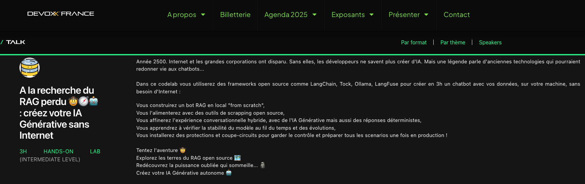

# [Devoxx 2025] A la recherche du RAG perdu 🤠🧭🤖 : créez votre IA Générative sans Internet
Ce projet github est issue du workshop fait par [Benjamin Bernard](https://www.devoxx.fr/agenda-2025/speaker/?id=64078), [Julien Buret](https://www.devoxx.fr/agenda-2025/speaker/?id=64082), [François Nollen](https://www.devoxx.fr/agenda-2025/speaker/?id=64073) et [Pierre Therrode](https://www.devoxx.fr/agenda-2025/speaker/?id=64079), pour le Devoxx 2025, avec comme sujet : [A la recherche du RAG perdu 🤠🧭🤖 : créez votre IA Générative sans Internet](https://devoxx.fr/talk?id=65062 )

## Sommaire

- [Introduction](step_0.md)

- [Mise en place de l'environnement](step_1.md)
- [Entrainements du bot](step_2.md)

- [Accélérons l'entrainement avec de l'IAGen](step_3.md)
- [Préparons notre base documentaire](step_4.md)
- [Activer l'IAGen dans notre bot](step_5.md)

- [Faire dérailler notre bot](step_6.md)
- [Reprendre le contrôle de notre bot](step_7.md)

- [Observabilité](step_8.md)
- [ Scrapping de données et RAG](step_9.md)

- [Connecter notre bot à notre boutique](step_10.md)

- [Remerciements](thanks-you.md)

## Pour aller plus loin

- [En savoir plus / ressources](resources.md)

