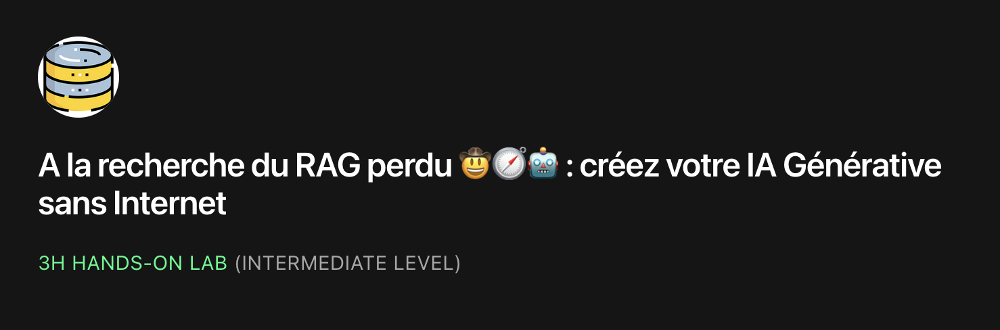
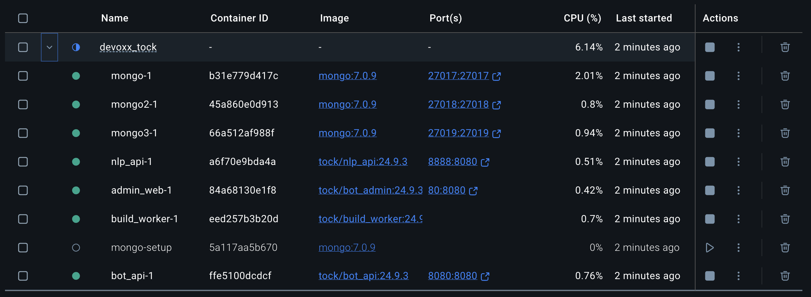

[](https://www.devoxx.fr/agenda-2025/talk/?id=65062)

Ce tutorial est proposé en amont de la session [A la recherche du RAG perdu 🤠🧭🤖 : créez votre IA Générative sans Internet](https://www.devoxx.fr/agenda-2025/talk/?id=65062) à Devoxx France 2025.

## Prérequis

### Docker
- Avoir installé [Docker Desktop](https://www.docker.com/products/docker-desktop/) sur votre machine


### Ollama
- Avoir installé [Ollama](https://ollama.com/download) sur votre machine
  


### Les modèles
- Avoir installé les principaux modèles pour l'atelier, commande à renseigner dans le terminal :
  ```bash
    ollama pull mistral
    ollama pull nomic-embed-text
  ```
Pour vérifier que nous avons les modèles sur notre machine, il suffit de taper cette commande dans notre terminal pour avoir ce type de rendu :

```bash
 ollama list
 ```


### Tock

Rendez-vous dans le dossier **docker** de ce dossier et renommez le fichier **template-internet.env** en **.env**.
Toujours depuis ce dossier, lancez les commandes suivantes dans votre terminal :

```bash
source .env
chmod a+r scripts/init-pgvect.sql
docker compose -p devoxx_tock up -d
```

<details>
  <summary>chmod n'est pas disponible sous windows voici l'étape avec powershell</summary>

    $file = "scripts\init-pgvect.sql"
    $acl = Get-Acl $file
    $accessRule = New-Object System.Security.AccessControl.FileSystemAccessRule("Everyone","Read","Allow")
    $acl.SetAccessRule($accessRule)
    $acl | Set-Acl $file
</details>

Une fois que tout est lancé, vous devriez avoir ce rendu au niveau des ressources si vous avez docker-desktop:


