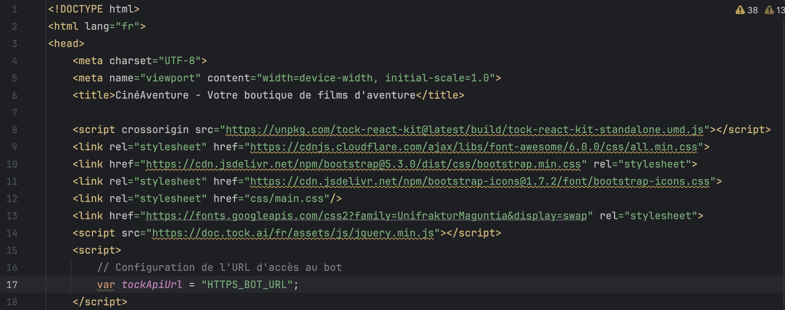

# Connecter notre bot à notre boutique

> "It's him", Indiana Jones and the Dial of Destiny, Steven Spielberg, 2023

 
<u>Objectifs:</u>

- Admirer notre magnifique boutique spécial Devoxx 2025
- Brancher le plugin web sur notre bot
- Discuter avec notre bot depuis la page web

## Sommaire

- [Lancer notre page web](#lancer-notre-page-web)
- [Brancher notre bot sur la page web](#brancher-notre-bot-sur-la-page-web)
- [Tester notre bot](#tester-notre-bot)

## Lancer notre page web

Pour lancer notre boutique spécial Devoxx 2025, qui se base sur les films d'aventure du moment, nous allons utiliser 
la page web [boutique.html](boutique.html).

## Brancher notre bot sur la page web

Dans le fichier [boutique.html](boutique.html) et à ligne 39 vous devez renseigner l’url d’accès au bot, cette même url que vous avez définie dans votre fichier [index.html](index.html).

Pour notre exemple, nous avons ce rendu :

## Tester notre bot

Pour tester notre bot, il suffit de lancer la page web [boutique.html](boutique.html) et de poser des questions sur les
produits de la boutique. Par exemple, vous pouvez demander à notre bot de vous montrer les produits disponibles, ou de
vous donner des informations sur un produit en particulier.

