# Accélérons l'entrainement avec de l'IAGen

[](https://www.youtube.com/watch?v=wROFvWDyugU)
> "Go !.. Go! Go!!",  Indiana Jones and the Temple of Doom, Steven Spielberg, 1984


Objectifs:
- Comprendre ce qu'est un LLM
- Activer et configurer un LLM Engine
- Utiliser l'IA Générative pour générer rapidement des phrases et entraîner plus rapidement le modèle

## Sommaire

- [Introduction](#introduction)
  - [LLM et modèles de fondation](#llm-et-modeles-de-fondation)


- [Lancer les services gen-ai](#lancer-les-services-gen-ai)


- [Installer Ollama](#installer-ollama)
  - [Récupérer les modèles pour l'atelier sur la machine GPU](#récupérer-les-modèles-pour-latelier-sur-la-machine-gpu)
    - [Autorisation de la registy locale insecure](#autorisation-de-la-registry-locale-insecure)
  - [Récupérer les modèles depuis internet hors du Codelab](#récupérer-les-modèles-depuis-internet-hors-du-codelab)
  - [Tester le prompt](#tester-le-prompt)
  - [⚠️ Fallback : Ollama ne marche pas](#-fallback--ollama-ne-marche-pas)


- [Gen AI - Sentence generation](#gen-ai---sentence-generation)
  - [Ollama](#Ollama)
      - [configuration sous Linux](#configuration-sous-linux)
      - [Configuration sous MacOs](#configuration-sous-macos)
      - [Tester l'accès à Ollama](#tester-laccès-à-ollama)
      - [Configurer Ollama dans le generate sentence](#configurer-ollama-dans-le-generate-sentence)
  - [Configurer OpenAI dans le generate sentence](#configurer-openai-dans-le-generate-sentence)
  - [Configurer AzureOpenAI dans le generate sentence](#configure-azureopenai-dans-le-generate-sentence)


- [Ressources](#ressources)
- [Étape suivante](#étape-suivante)

## Introduction

Cette introduction a pour objectif d’expliquer la notion de LLM.

## LLM et modèles de fondation

Un modèle de langage à grande échelle (LLM, pour Large Language Model) est un système d’intelligence artificielle conçu 
pour comprendre et générer du texte en s’appuyant sur un vaste corpus d’apprentissage. Entraîné sur des milliards de 
paramètres, il peut analyser et produire du contenu textuel qui imite le langage humain avec un niveau de cohérence et 
de pertinence remarquable. Ces modèles fonctionnent grâce à des architectures de réseaux de neurones profonds, 
principalement basées sur des transformers, qui leur permettent de capturer les nuances linguistiques, les contextes et 
les relations sémantiques complexes. Les LLM peuvent accomplir diverses tâches linguistiques comme répondre à des 
questions, résumer des textes, traduire entre langues, rédiger différents types de contenus, et même raisonner sur des 
problèmes complexes, le tout sans avoir été spécifiquement programmés pour chacune de ces tâches. Leur capacité 
d’apprentissage par transfert leur permet d’adapter leurs connaissances générales à des domaines spécifiques avec un 
minimum d’exemples supplémentaires.

Les modèles de fondation sont une catégorie plus large de modèles d’intelligence artificielle qui servent de base pour 
de multiples applications et adaptations. Un modèle de fondation peut être un LLM, mais il peut aussi être entraîné pour 
traiter des images, de l’audio, ou des données multimodales (combinant plusieurs types de médias). Ces modèles sont 
conçus pour être polyvalents et réutilisables dans divers contextes, pouvant être adaptés et affinés pour des tâches 
spécifiques sans nécessiter un ré-entraînement complet.
Les modèles de fondation se caractérisent par leur adaptabilité et leur capacité à effectuer un large éventail de tâches 
disparates avec précision en fonction des instructions reçues. Ils se divisent principalement en trois catégories : 

- ceux dédiés au traitement du langage naturel (comme GPT-4 ou Llama)
- ceux spécialisés dans la vision par ordinateur (comme Stable Diffusion ou DALL-E)
- les systèmes multimodaux capables d’intégrer plusieurs types de données.

Contrairement aux modèles traditionnels qui sont limités à une fonction spécifique, les modèles de fondation sont 
entraînés sur des données à grande échelle et développent une compréhension profonde des données initiales, ce qui leur 
permet d’être ensuite affinés pour des cas d’usage précis.

Cette approche de préentraînement suivie d’ajustements 
spécifiques constitue leur principe fondamental de fonctionnement.

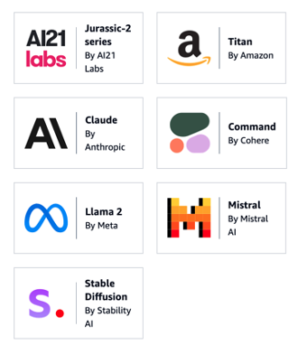

Exemple non exhaustif de modèles de fondation


Pour utiliser une analogie de la fuséologie, considérez les **LLM** comme des **moteurs de fusée** spécialisés conçus pour 
propulser des missions spécifiques (dans ce cas, le traitement du langage). Les **modèles de fondation**, en revanche, 
sont comme des **plates-formes de lancement** modulaires qui peuvent soutenir différents types de missions — qu'il s'agisse
de lancer un satellite, d'envoyer un rover sur Mars ou de mettre en orbite un télescope spatial.


Vous en conviendrez que si la plates-forme de lancement (**Fondation Model**) est solide et droite, la fusée (le **LLM**) 
fait un strike dans l'espace, en revanche si le la plates-forme de lancement est bancale et que la fusée part chez le 
voisin, il risque d'y avoir des dégâts !

En se basant sur des modèles de fondation solides et éprouvés, les développeurs peuvent créer des applications qui utilisent l'IA de manière plus efficace et plus sûre.

## Lancer les services gen-ai

Dans le fichier `docker/docker-compose.yml` décommenter les services `gen_ai_orchestrator-server:`, `postgres-db:` et relancer un :
```bash
cd docker
source .env
docker compose -p devoxx_tock up -d
```

Vous devriez avoir ce rendu depuis la console :

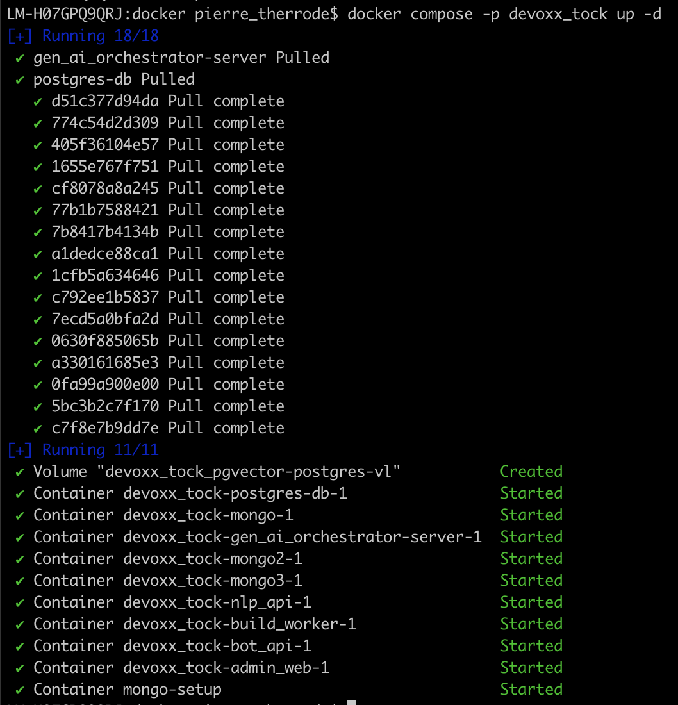

Si vous tout est bon en vous rendant sur cette page : http://localhost:8000/docs, vous devriez avoir cette page Swagger

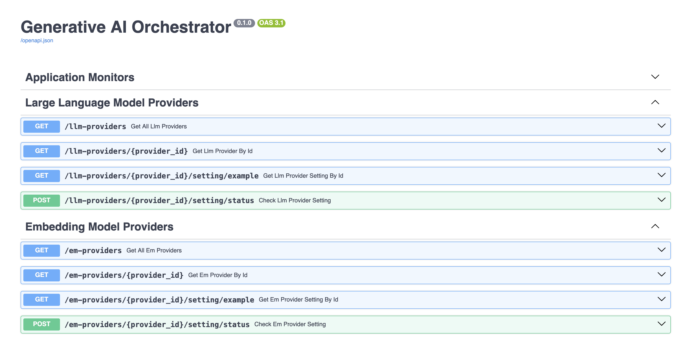

## Installer Ollama

Pour installer Ollama, vous devez aller sur le lien suivant : https://ollama.com/ et suivre les instructions pour télécharger Ollama sur votre machine. Une fois que cela est fait, dézipper le fichier et installer le programme sur votre machine. A la fin de l’installation Ollama vous conseil d’installer un model sur votre machine. Ce modèle fait plus de 6Go, et nous n’allons pas en avoir besoin. Il faut donc décliner le téléchargement de ce modèle.

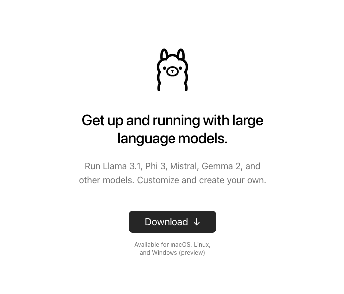

### Récupérer les modèles pour l'atelier sur la machine GPU

Pour éviter de congestionner le réseau, nous avons pré-téléchargé les modèles pour vous et hébergé une registry ollama locale à partir de laquelle vous pouvez le modèle **nomic-embed-text:latest** pour l'embedding et dans un premier temps **qwen2.5:1.5b** :

| Modèle                      | Type            | Pull                                                                                | Recommandation RAM vidéo min (en Q4_K_M) |
|-----------------------------|-----------------|-------------------------------------------------------------------------------------|------------------------------------------|
| **nomic-embed-text:latest** | Embedding       | `ollama pull --insecure http://gpu-server.lan:9200/library/nomic-embed-text:latest` | Pass partout 😌                          |
| **qwen2.5:1.5b**            | Text Generation | `ollama pull --insecure http://gpu-server.lan:9200/library/qwen2.5:1.5b`            | >2 GB (4bit quantized)                   |
| **qwen2.5:3b**              | Text Generation | `ollama pull --insecure http://gpu-server.lan:9200/library/qwen2.5:3b`              | >2 GB (4bit quantized)                   |
| **mistral:7b**              | Text Generation | `ollama pull --insecure http://gpu-server.lan:9200/library/mistral:7b`              | >4 GB (4bit quantized)                   |
| qwen2.5:7b                  | Text Generation | `ollama pull --insecure http://gpu-server.lan:9200/library/qwen2.5:7b`              | >4 GB (4bit quantized)                   |
| qwen2.5:14b                 | Text Generation | `ollama pull --insecure http://gpu-server.lan:9200/library/qwen2.5:14b`             | >8 GB (4bit quantized)                   |
| phi4:14b                    | Text Generation | `ollama pull --insecure http://gpu-server.lan:9200/library/phi4:14b`                | >8 GB (4bit quantized)                   |
| gemma3:4b                   | Text Generation | `ollama pull --insecure http://gpu-server.lan:9200/library/gemma3:4b`               | >2 GB (4bit quantized)                   |
| gemma3:12b                  | Text Generation | `ollama pull --insecure http://gpu-server.lan:9200/library/gemma3:12b`              | >7 GB (4bit quantized)                   |

Les modèles en gras sont les modèles recommandés pour vos tests, ne téléchargez pas tout les modèles 😉, nous en avons mis plusieurs à votre disposition pour ceux qui souhaitent tester.

```bash

ollama list # Devrait vous afficher les modèles
```


### Récupérer les modèles depuis internet hors du Codelab

Pour utiliser les modèles en dehors de l'environnement d'atelier, nous vous recommandons de télécharger différents 
modèles selon les capacités de votre machine :

- **qwen2.5:1.5b** idéal pour les machines avec des ressources limitées
- **Mistral** et **gemma**, recommandés si vous disposez d'au moins 16 Go de RAM

Pour la partie embedding (vectorisation du texte), nous utiliserons :
- **nomic-embed-text**

La récupération d'un modèle depuis Ollama s'effectue simplement via la commande suivante :

```bash
ollama pull <le_nom_de_votre_modèle>
```

Dans notre cas, nous allons récupérer les modèles suivants en tapant ces comamndes dans le terminal :
```
ollama pull mistral
ollama pull nomic-embed-text
```

Pour vérifier que nous avons les modèles sur notre machine, il suffit de taper cette commande dans notre terminal pour avoir ce type de rendu :

```bash
 ollama list
 ```


💡Si vous souhaitez en savoir plus sur les modèles, c'est par ici :

| Modèle            | Lien                                                                                       |
|-------------------|--------------------------------------------------------------------------------------------|
| Tinyllama         | [https://ollama.com/library/tinyllama](https://ollama.com/library/tinyllama)               |
| Gemma             | [https://ollama.com/library/gemma](https://ollama.com/library/gemma)                       |
| Mistral 🇫🇷      | [https://ollama.com/library/mistral](https://ollama.com/library/mistral)                   |
| Nomic-embed-text  | [https://ollama.com/library/nomic-embed-text](https://ollama.com/library/nomic-embed-text) |
 

### Tester le prompt

```bash
ollama run mistral
```

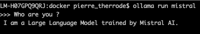

Une fois ce modèle téléchargé et toujours dans le terminal, vous pouvez tester/jouer avec le modèle (entrez une question 
pour voir si le modèle répond), ou quitter en appuyant sur CTRL + D.

### ⚠️ Fallback : Ollama ne marche pas

Installation trop lente ? ça rame .... pas de soucis vous allez pouvoir utiliser le serveur Ollama présent sur **http://gpu-server.lan:11434**.
N'installez pas Ollama passez à la suite.

Modifiez dans le fichier `docker/.env` les lignes suivantes pour utiliser le serveur ollama du codelab :
```bash
# Ollama (requires RAM and works better with a GPU)
#   export OLLAMA_SERVER=host-gateway # LOCAL ollama server
#   export OLLAMA_SERVER=192.168.20.2 # OUR CODELAB ollama server at gpu-server.lan, unfortunately docker compose needs an IP addr
export OLLAMA_SERVER=192.168.20.2 # OUR CODELAB ollama server at gpu-server.lan, unfortunately docker compose needs an IP addr
```


## Gen AI - Sentence generation

Désormais, on va utiliser notre l'IA Générative (notre LLM) pour générer rapidement des nouvelles phrases et variantes.
Cela permettra d'entraîner plus rapidement notre modèle initial, donc d'améliorer la compréhension du bot.
Pour autant, le bot utilisera toujours les mêmes réponses qu'auparavant. On ne donne donc pas "carte blanche" à l'IA
Générative, ce n'est pas elle qui répond, elle ne peut pas improviser ou halluciner.
Pour le moment, elle améliore donc la compréhension du bot, sans perdre le contrôle sur les différentes réponses du bot.

Le menu **Gen AI** > **Sentence Generation Settings** permet de configurer la génération de phrases d'entraînement pour les bots FAQ.

> Remarque : pour accéder à cette page, il faut bénéficier du rôle **_botUser_**.

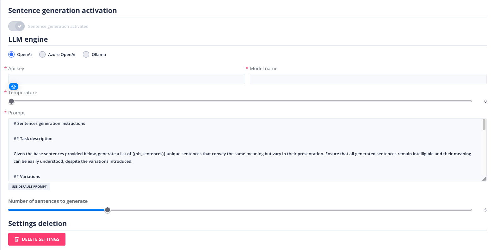

Pour activer la fonction de génération de phrases, vous devez choisir :

**Un provider IA :**
- Voir la [liste des fournisseurs d'IA](providers/gen-ai-provider-llm-and-embedding.md)


**Une "température" (par défaut pour les nouvelles phrases) :**
- Cela correspond au degré d’inventivité du modèle utilisé pour générer des phrases.
- La température est située entre 0 et 1.0.
  - 0 = pas de latitude dans la création des phrases
  - 1.0 = grande latitude dans la création des phrases

**Un prompt :**
- C'est un ensemble d'instructions permettant de cadrer la génération de nouvelles phrases d'entraînement.

**Le nombre de phrases :**
- Nombre de phrases d'entraînement générées par chaque requête.

**Activation :**
- Permet d'activer la fonctionnalité.


### Ollama

Si vous avez bien suivi l'[étape 1](step_1.md) du codelab, Ollama est installé avec tinyOllama sur votre machine.

Avec notre environnement Docker, Ollama doit etre accessible sur le réseau 0.0.0.0.

### Configuration sous Linux

Si vous êtes sur Linux, nous vous invitons à suivre ces étapes.

Pour exposer ollama à toutes les adresses IP, il faut aller modifier le fichier /etc/systemd/system/ollama.service.
Changer les lignes suivantes :    
```markdown
[Service]
ExecStart=/usr/local/bin/ollama serve
User=ollama
Group=ollama
Restart=always
RestartSec=3
#...
Environment="OLLAMA_HOST=0.0.0.0:11434"
```

Puis redémarrer le service ollama avec les commandes suivantes :
```bash
sudo systemctl daemon-reload
sudo systemctl restart ollama.service
```

### Configuration sous MacOs

Sur MacOs pour exposer Ollama sur l'ip 0.0.0.0, suivez les instructions de cette issue : https://github.com/ollama/ollama/issues/3581#issuecomment-2052338405

```bash
launchctl setenv OLLAMA_HOST "0.0.0.0"
# Si installé via homebrew : restart ollama
brew services restart ollama 
# Sinon en mode graphique via l'icon en haut
```


### Tester l'accès à Ollama

Assurez-vous que Ollama est bien accessible sur l'ip en vous rendant sur l'url suivante : http://0.0.0.0:11434/. 
Vous devriez avoir ce rendu.

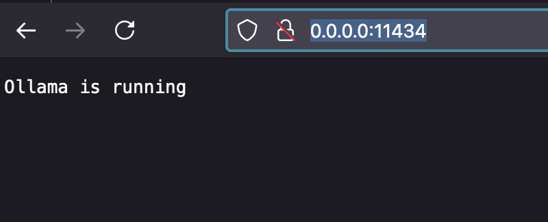

### Configurer Ollama dans le generate sentence

<details>
  <summary>Voir la configuration Ollama</summary>

Pour connecter ollama à Tock studio, il vous faut renseigner l’accès à Ollama via cette url d’accès : http://ollama-server:11434 .
Pour le modèle, là c’est à vous de renseigner le nom du modèle que vous utilisez dans ce CodeLab (ici nous avons tinyllama)

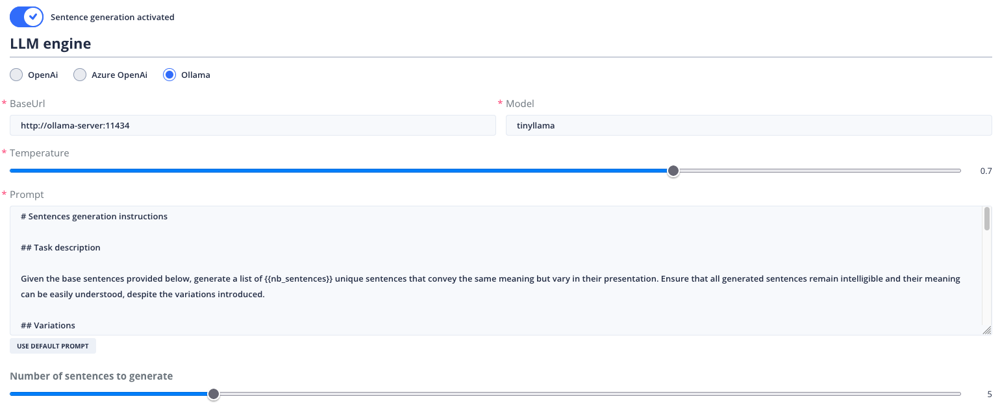

</details>


### Configurer OpenAI dans le generate sentence

<details>
  <summary>Voir la configuration openAI</summary>

Si vous souhaitez utiliser openAI, vous devez vous inscrire sur la plateforme [OpenAI](https://platform.openai.com/docs/introduction)
pour obtenir une clé d'API (attention cela nécessite d'acheter des crédits).
Une fois cela fait rendez-vous à cette page [https://platform.openai.com/api-keys](https://platform.openai.com/api-keys) 
pour générer votre clé d'API.

Dès que vous avez votre clé d'API, vous pouvez la renseigner dans le champ **API Key** et choisir le model (**Model name**) que vous souhaitez utiliser.
Par exemple vous pourriez avoir ce genre de rendu.

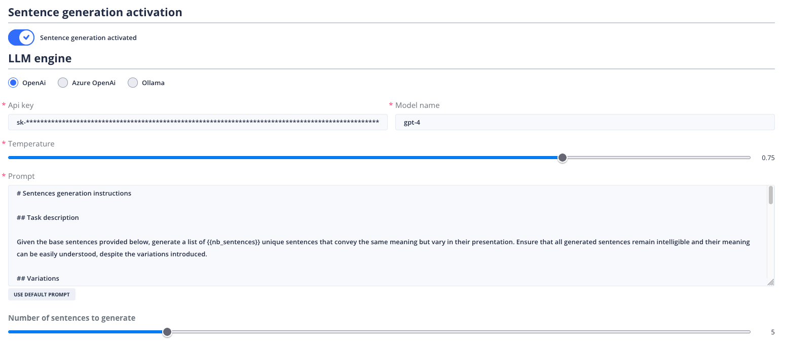

</details>


### Configure AzureOpenAI dans le generate sentence

<details>
  <summary>Voir la configuration Azure</summary>

Si vous souhaitez utiliser Azure OpenAI, vous devez vous inscrire sur la plateforme
[Azure OpenAI](https://azure.microsoft.com/fr-fr/products/ai-services/openai-service) et d'avoir un compte professionnel  
afin d'avoir une clé d'API.
Une fois cela fait, vous pouvez renseigner votre clé d'API dans le champ **API Key** et choisir le model (**Model name**)
que vous souhaitez utiliser.


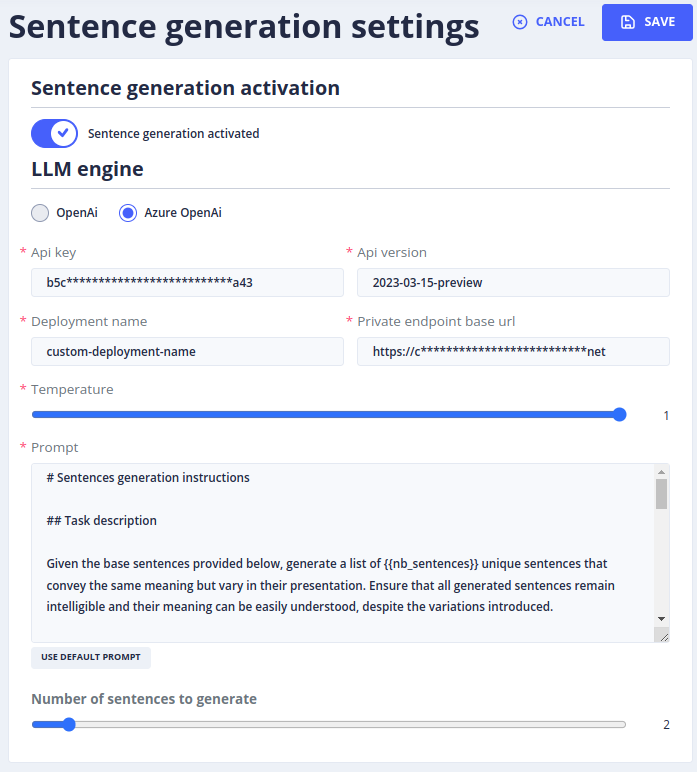

</details>

## Générer des phrases d'entraînement
Pour vérifier que l'IA générative est bien configurée, allez dans **Stories & Answers** > **FAQs stories**. 
Là, vous allez cliquer sur **+ NEW FAQ STORY**.

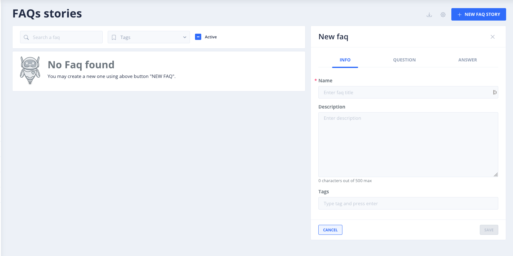

Dans l’onglet **QUESTION** et dans le champ comportant le même champ.
Pour l’exemple, nous avons cette phrase « bonjour le bot » que nous ajoutons comme question en appuyant sur le **+**.

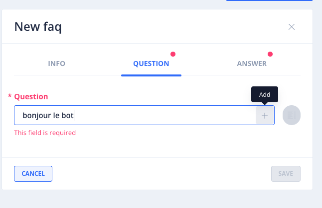

Dès que cela est fait, cliquez sur l’icône **Generate sentences**.

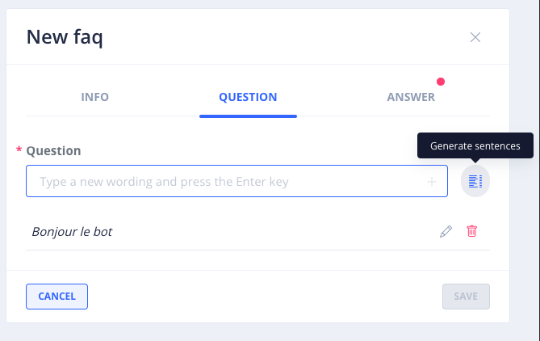

Cela va ouvrir une pop-up comme celle-ci vous permettant de générer des mots ou des phrases.

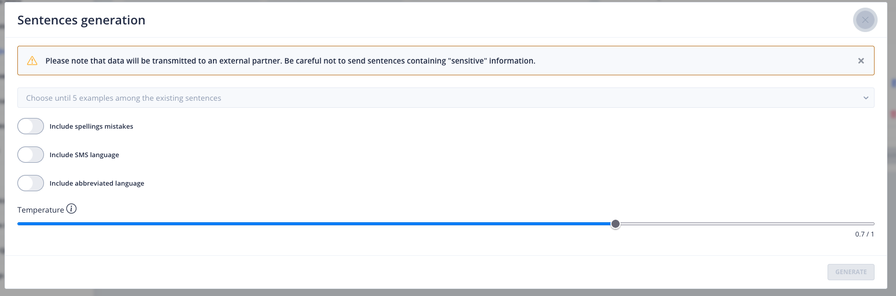

Là, vous allez choisir votre phrase que vous avez renseigné juste avant puis choisir les éléments de langages que vous 
souhaitez générer. Une fois cela fait, cliquer sur **GENERATE**

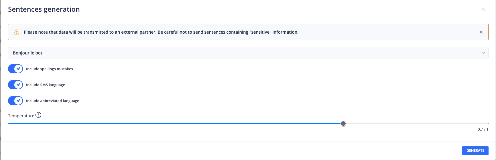

Aprés quelques secondes vous devriez avoir ce genre de rendu.

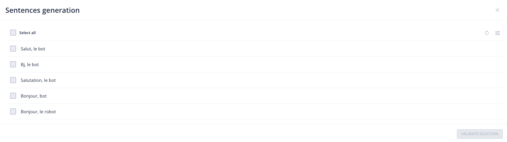

Vous pouvez tout sélectionner puis valider, chose qui vous ramènera à la page de la FAQ. 
Là, vous pourrez voir que les questions générer par l’IA ont été importées.

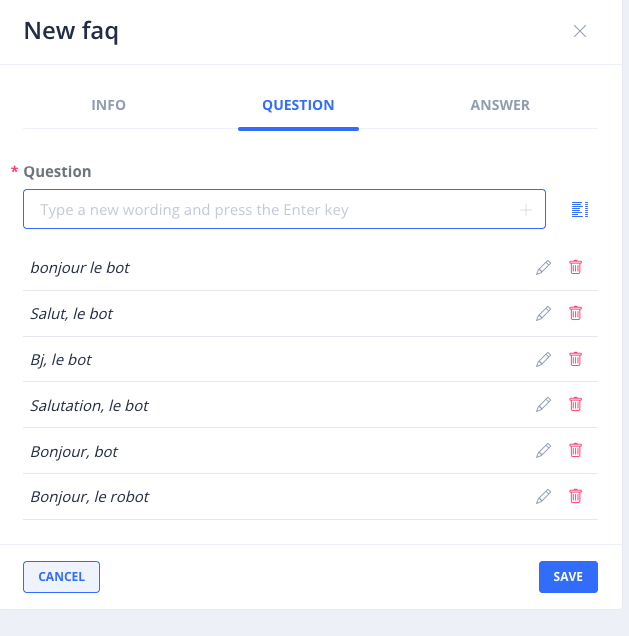

Vous pouvez cliquer ensuite sur l’onglet **Answer** pour rédiger une réponse, puis cliquer sur **SAVE**.


## Ressources
| Titre                                                                                  | Lien                                                                                                                                                                                                                                             |
|----------------------------------------------------------------------------------------|--------------------------------------------------------------------------------------------------------------------------------------------------------------------------------------------------------------------------------------------------|
| Ce qui se cache derrière le fonctionnement de ChatGPT (ScienceEtonnante)               | [https://www.youtube.com/watch?v=7ell8KEbhJo](https://www.youtube.com/watch?v=7ell8KEbhJo)                                                                                                                                                                             |
| Comprendre et utiliser les modèles de langage d'IA (Sébastien COLLET @ Devoxx 2023)    | [https://www.youtube.com/watch?v=ZbWL2W53BXY](https://www.youtube.com/watch?v=ZbWL2W53BXY)                                                                                                                                                                             |
| Attention Is All You Need                                                              | [https://arxiv.org/abs/1706.03762](https://arxiv.org/abs/1706.03762)                                                                                                                                                                             |
| The Illustrated Transformer                                                            | [http://jalammar.github.io/illustrated-transformer/](http://jalammar.github.io/illustrated-transformer/)                                                                                                                                         |
| Evaluating Large Language Model (LLM) systems: Metrics, challenges, and best practices | [https://medium.com/data-science-at-microsoft/evaluating-llm-systems-metrics-challenges-and-best-practices-664ac25be7e5](https://medium.com/data-science-at-microsoft/evaluating-llm-systems-metrics-challenges-and-best-practices-664ac25be7e5) |
| Le Prompt Engineering : L'art de converser avec l'intelligence artificielle            | [https://blog.lesjeudis.com/le-prompt-engineering](https://blog.lesjeudis.com/le-prompt-engineering)                                                                                                                                             |
| Influence response generation with inference parameters                                | [https://docs.aws.amazon.com/bedrock/latest/userguide/inference-parameters.html](https://docs.aws.amazon.com/bedrock/latest/userguide/inference-parameters.html)                                                                                 |
| Demystifying AI Inference Deployments for Trillion Parameter Large Language Models     | [https://developer.nvidia.com/blog/demystifying-ai-inference-deployments-for-trillion-parameter-large-language-models/](https://developer.nvidia.com/blog/demystifying-ai-inference-deployments-for-trillion-parameter-large-language-models/)   |
| An Evaluation of Vector Database Systems: Features, and Use Cases                      | [https://blog.devgenius.io/an-evaluation-of-vector-database-systems-features-and-use-cases-9a90b05eb51f](https://blog.devgenius.io/an-evaluation-of-vector-database-systems-features-and-use-cases-9a90b05eb51f)   | 
| Awesome Foundation Models                                                              | [https://github.com/uncbiag/Awesome-Foundation-Models?tab=readme-ov-file](https://github.com/uncbiag/Awesome-Foundation-Models?tab=readme-ov-file)                                                                                               | 
| Que sont les modèles de fondation ?                                                    | [https://aws.amazon.com/what-is/foundation-models/](https://aws.amazon.com/what-is/foundation-models/)                                                                                                       |


## Étape suivante

- [Étape 4](step_4.md)
