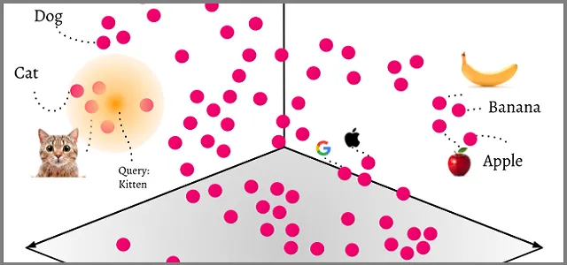
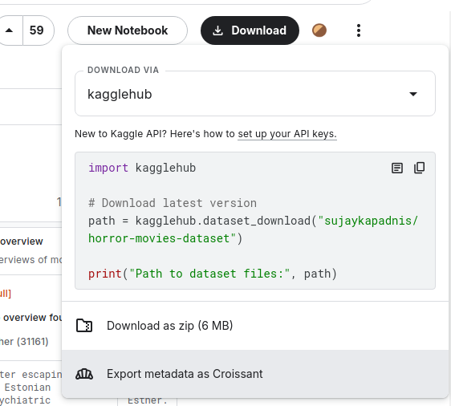
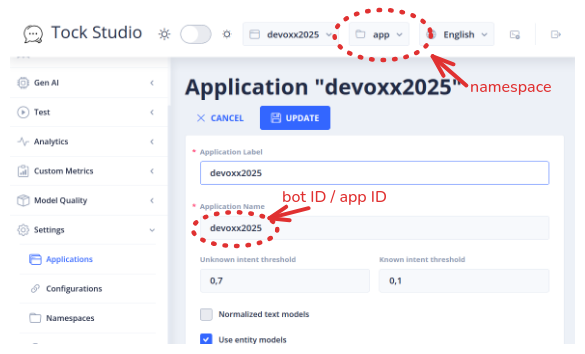
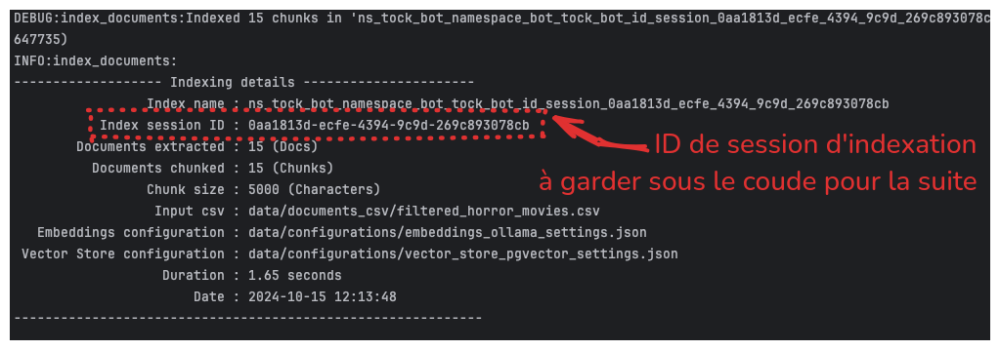

# Préparons notre base documentaire


[](https://www.youtube.com/watch?v=dvywOjh_hdY)

> "You don't disappoint Dr Jones, you're a great deal like your father", Indiana Jones Last Crusade, Steven Spielberg, 1989

<br/>
<u>Objectifs:</u>

- Comprendre comment nous allons faire rentrer une base documentaire dans le bot, concept du Retrieval Augmented Generation
- Récupérer un ensemble documentaire, le transformer dans le bon format
- Utiliser les tool d'ingestion pour le vectoriser et charger dans la base documentaire de notre bot

## Sommaire

- [Qu'est-ce que le RAG ?](#quest-ce-que-le-rag)
  - [J'aime lire](#jaime-lire)
  - [Le concept des bases de données vectorielles](#le-concept-des-bases-de-données-vectorielles)
  - [Recherche par similarité](#recherche-par-similarité)
  - [Applications concrètes](#applications-concrètes)
  - [Exemples de bases vectorielles](#exemples-de-bases-vectorielles)

  
- [Trouver un data set sur kaggle](#trouver-un-data-set-sur-kaggle)
- [Découverte du tooling et du format](#découverte-du-tooling-et-du-format)
  - [Exemple de script python utilisant Panda](#exemple-de-script-python-utilisant-panda)
  

- [Ingestion avec le tooling](#ingestion-avec-le-tooling)
  - [Configuration d'embedding](#configuration-d-embedding)
    - [Configuration avec ollama](#configuration-avec-ollama)
    - [Configuration avec OpenAI ou Azure OpenAI](#configuration-avec-openai-ou-azure-openai)
    - [Lancer l'ingestion](#lancer-lingestion)


- [Étape suivante](#étape-suivante)

## Qu'est-ce que le RAG


### J'aime lire
Imaginez que vous lisez un livre, à chaque idée dans le livre, vous allez arracher la ou les pages pour les placer dans 
un coin de votre pièce de votre maison ou appartement (ou un château, cela dépend de votre budget !). Quand un(e) ami(e) 
vous demande par exemple de quoi parle le chapitre 5 du livre que vous avez lu, vous allez chercher dans le coin de la 
pièce les pages correspondantes pour lui répondre avec vos propres mots.

Là vous avez lu un livre, imaginez maintenant que vous avez lu des milliers de livres, et que vous avez arraché des pages
de chaque livre pour les placer dans un coin des différentes pièces de votre domicile. Vous devez être incollable !

### Le concept des bases de données vectorielles

Maintenant, c'est un programme informatique qui va lire les livres, extraire les idées des pages pour les placer non pas 
dans un coin de votre domicile mais dans une base de données dite vectorielle. L'extraction d'information utilise une 
technique de découpage (embedding) pour transformer les idées en vecteurs numériques qui seront stockés dans la base de 
données vectorielle.

**La multi-dimensionnalité :** Contrairement à notre exemple physique limité à trois dimensions (longueur, largeur, hauteur), 
les bases vectorielles opèrent dans des espaces à plusieurs centaines, voire milliers de dimensions. Chaque dimension 
représente une caractéristique sémantique du texte. Par exemple, un vecteur pourrait avoir une dimension pour le niveau 
de formalité, une autre pour le domaine scientifique, une autre encore pour la tonalité émotionnelle, et ainsi de suite.

**Proximité sémantique :** Plus les idées sont similaires conceptuellement, plus leurs vecteurs sont proches dans cet espace 
multidimensionnel. Cette proximité est mesurée mathématiquement par des métriques comme la distance cosinus ou euclidienne. 
Ainsi, deux paragraphes parlant de physique quantique, même avec des mots différents, se retrouveront proches l'un de 
l'autre dans l'espace vectoriel.

**Gestion des données non structurées :** L'un des grands avantages des bases vectorielles est leur capacité à traiter 
efficacement des données non structurées comme du texte, des images ou des sons. Là où les bases de données traditionnelles 
exigent des schémas rigides, les bases vectorielles convertissent ces données complexes en représentations numériques comparables.



### Recherche par similarité

Quand vous interrogez une base vectorielle, votre requête est elle-même transformée en vecteur. Le système recherche 
alors les vecteurs les plus proches de celui de votre requête. C'est comme si, au lieu de demander "où sont 
les pages du chapitre 5 ?", vous demandiez "où sont les pages qui parlent de révolution industrielle ?" et que votre 
ami intelligent parcourait instantanément tous les coins de son appartement pour trouver les pages conceptuellement liées 
à ce sujet.

Cette recherche par similarité permet :
- De trouver des informations pertinentes même si elles ne contiennent pas exactement les mêmes mots que votre requête
- De découvrir des connexions thématiques que vous n'auriez pas anticipées
- D'obtenir des résultats nuancés, classés par degré de pertinence

### Applications concrètes

On a évoqué les livres, mais cela fonctionne parfaitement avec vos documents numériques tels que des articles, 
des pages web, des documents PDF, des fichiers texte, des bases de données, etc. Les bases vectorielles sont 
particulièrement utiles pour :

- Les moteurs de recherche sémantique
- Les systèmes de recommandation de produits ou contenus
- Les assistants IA capables de puiser dans une base de connaissances
- L'analyse de sentiment et la détection de tendances dans de grands corpus


### Exemples de bases vectorielles

**Pinecone** est l'une des bases vectorielles les plus populaires, offrant une infrastructure cloud qui permet de 
stocker et rechercher des milliards de vecteurs avec une latence minimale. Elle s'intègre facilement avec les frameworks 
d'IA modernes et propose des fonctionnalités avancées comme le filtrage métadonnées et la mise à jour en temps réel.

**Vectorize** (par SingleStore) combine la puissance des bases vectorielles avec celle des bases SQL traditionnelles, 
permettant des requêtes hybrides qui associent recherche par similarité et filtrage structuré. Cela permet par exemple 
de chercher des documents similaires à votre requête, mais uniquement parmi ceux publiés après une certaine date.

**pgvector** est une extension pour PostgreSQL qui ajoute la prise en charge des types de données vectorielles. Cela 
permet d'utiliser PostgreSQL comme une base de données vectorielle.

D'autres solutions comme **Weaviate**, **Milvus**, et **Qdrant** offrent également des fonctionnalités spécialisées 
pour différents cas d'usage, de l'intégration avec des modèles de langage spécifiques à l'optimisation pour certains 
types de données.

Cette technologie est au cœur de nombreuses applications d'IA modernes, permettant de naviguer intelligemment dans des 
océans d'informations non structurées avec une précision et une nuance impossibles avec les méthodes de recherche 
traditionnelles.


Le **RAG** (**R**etrieving **A**ugmented **G**eneration) est une méthode qui combine la récupération 
d'informations (**retrieval**) avec la génération de texte par une intelligence artificielle (**IA**) ou un 
modèle de langage (**LLM**).

Cette technique permet à l'IA de répondre à des questions en s'appuyant sur une base de connaissances externe, 
généralement stockée dans une base de données vectorielle.


## Trouver un data set sur kaggle

Vous pouvez rechercher n'importe quel dataset de la thématique qui vous intéresse idéalement un dataset avec des URL ou 
références vous permettant de relier les documents à des versions en ligne.

Dataset proposés sur Kaggle :
* [Séries TV](https://www.kaggle.com/datasets/asaniczka/full-tmdb-tv-shows-dataset-2023-150k-shows), notre exemple se basera dessus.
* [Horror Movies dataset](https://www.kaggle.com/datasets/sujaykapadnis/horror-movies-dataset/data)

Télécharger le dataset en zip et le décompresser dans le dossier `data/documents_csv/`.
Sinon fichier disponibles en local ici [TMDB_tv_dataset_v3.csv](http://gpu-server.lan:8088/TMDB_tv_dataset_v3.csv).




## Découverte du tooling et du format

Pour ingérer ce dataset nous allons utiliser le script [index_documents.py de TOCK documenté ici](https://github.com/theopenconversationkit/tock/tree/master/gen-ai/orchestrator-server/src/main/python/tock-llm-indexing-tools#documents-indexing), il prend en entrée un csv à 3 colonnes (`source|title|text`, séparateur pipe `|`). Il va donc falloir convertir votre fichier dans ce format nous vous conseiller également de filtrer le fichier et vous limiters à un échantillons de 5-15 lignes, l'idée étant de limiter le temps de vectorisation si vous êtes en local (ollama sans GPU).

Format du fichier CSV d'entrée :
```csv
"id","name","number_of_seasons","number_of_episodes","original_language","vote_count","vote_average","overview","adult","backdrop_path","first_air_date","last_air_date","homepage","in_production","original_name","popularity","poster_path","type","status","tagline","genres","created_by","languages","networks","origin_country","spoken_languages","production_companies","production_countries","episode_run_time"
"1399","Game of Thrones","8","73","en","21857","8.442","Seven noble families fight for control of the mythical land of Westeros. Friction between the houses leads to full-scale war. All while a very ancient evil awakens in the farthest north. Amidst the war, a neglected military order of misfits, the Night's Watch, is all that stands between the realms of men and icy horrors beyond.","False","/2OMB0ynKlyIenMJWI2Dy9IWT4c.jpg","2011-04-17","2019-05-19","http://www.hbo.com/game-of-thrones","False","Game of Thrones","1083.917","/1XS1oqL89opfnbLl8WnZY1O1uJx.jpg","Scripted","Ended","Winter Is Coming","Sci-Fi & Fantasy, Drama, Action & Adventure","David Benioff, D.B. Weiss","en","HBO","US","English","Revolution Sun Studios, Television 360, Generator Entertainment, Bighead Littlehead","United Kingdom, United States of America","0"
```

Voici un script python qui convertie la dataset donnée en exemple dans ce format de sortie en en gardant qu'une portion. Vous pouvez effectuer ces opération dans le langage de votre choix.

### Exemple de script python utilisant Panda - Data set séries TV

Ce script est présent dans [data/scripts/transform_tv_shows.py](./data/scripts/transform_tv_shows.py), nous vous proposons une image docker de tooling pour l'exécuter plus bas.

```python
import pandas as pd

# Load the CSV file
df = pd.read_csv('/app/data/documents_csv/TMDB_tv_dataset_v3.csv')

# Set the number of random rows you want to keep
n = 35  # Example value

# Filter only rows that contain "Sci-Fi" in the genres, "netflix" or "hbo" in the networks, and have a vote_average over 8
df = df[df['genres'].str.contains('Sci-Fi', na=False) & df['networks'].str.contains('netflix|hbo', case=False, na=False) & (df['vote_average'] > 8)]
# Randomly select n rows
df_sampled = df.sample(n=n, random_state=42)  # random_state ensures reproducibility

# Keep only the specified columns
columns_to_keep = [
    'name', 'number_of_seasons', 'number_of_episodes', 'original_language',
    'overview', 'first_air_date', 'last_air_date', 'homepage', 'created_by', 'genres', 'networks'
]
df_filtered = df_sampled.loc[:, columns_to_keep]

# Create a new column 'text' based on the template
text_template = (
    "### $name\n\n"
    "* TV Show name : $name\n"
    "* Number of seasons  : $number_of_seasons\n"
    "* Number of episodes : $number_of_episodes\n"
    "* Original language : $original_language\n"
    "* First diffusion / Air date : $first_air_date\n"
    "* Last diffusion / Air date : $last_air_date\n"
    "* Show created by : $created_by\n"
    "* Genres : $genres\n\n"
    "#### Overview of $name\n"
    "$overview\n"
    "\n\n"
)

df_filtered['text'] = df_filtered.apply(lambda row: text_template
    .replace('$name', str(row['name']))
    .replace('$number_of_seasons', str(row['number_of_seasons']))
    .replace('$number_of_episodes', str(row['number_of_episodes']))
    .replace('$original_language', str(row['original_language']))
    .replace('$first_air_date', str(row['first_air_date']))
    .replace('$last_air_date', str(row['last_air_date']))
    .replace('$created_by', str(row['created_by']))
    .replace('$genres', str(row['genres']))
    .replace('$overview', str(row['overview'])), axis=1)

# Rename columns
df_filtered.rename(columns={'homepage': 'source', 'text': 'text', 'name': 'title'}, inplace=True)

# Keep only the specified columns
columns_to_keep = ['source', 'title', 'text']
df_filtered = df_filtered.loc[:, columns_to_keep]

# Save the filtered DataFrame to a CSV file
df_filtered.to_csv('data/documents_csv/filtered_tv_series.csv', index=False, sep='|')
```

Exécution du script via l'image de tooling a la racine du dossier de cet atelier :
```bash
# Sourcer vos variables d'environnement
source docker/.env
# Lancer le conteneur de tooling pour exécuter le script
docker run --name tooling_tock --rm -it \
    -v "$(pwd)/data":/app/data \
    -e NO_PROXY="host.docker.internal,ollama-server,postgres-db,localhost" \
    -e no_proxy="host.docker.internal,ollama-server,postgres-db,localhost" \
    --add-host=ollama-server:$OLLAMA_SERVER \
    --add-host=postgres-db:$POSTGRES_DB_SERVER \
    "${PLATFORM}tock/llm-indexing-tools:${TAG}" \
    /bin/bash
```

Dans le conteneur :
```bash
# Excuter le script
python /app/data/scripts/transform_tv_shows.py

# Vérifiez le contenu du CSV filtré
head data/documents_csv/filtered_tv_series.csv -n 45
```

Nous vous avons déjà mis à disposition le fichier résultant de ce filtre si besoin ici dans `data/documents_csv/filtered_tv_series.csv`.

## Ingestion avec le tooling

Maintenant que nous avons nos données dans le bon format il est nécessaire de les ingérer dans notre base documentaire. TOCK est compatible avec [OpenSearch](https://github.com/theopenconversationkit/tock-docker/blob/master/docker-compose-rag-opensearch.yml) et PGVector (utilisé dans ce codelab).

L'ingestion consite globalement en 2 grandes étapes :
* Découper les données en chunk de manière à maitriser la taille du contexte documentaire qui sera fourni au LLM
* Vectoriser chacun des chunks à l'aide d'un modèle d'embedding, pour pouvoir chercher les bons morceaux à terme avec la requête utilisateur qui sera elle même vectorisée à l'aide du même modèle.

### Configuration d'embedding

Vous l'avez compris nous avons besoin d'un modèle qui depuis un texte (description d'un film), nous sort un vecteur qui représente ce texte. Nous allons utiliser le modèle [nomic-embed-text](https://ollama.com/library/nomic-embed-text), vous pouvez retrouver d'autres [modèles d'embedding compatible ollama ici](https://ollama.com/search?&c=embedding).

Cette vectorisation intervient à deux endroits, pour ingérer la base documentaire (configuré à l'aide d'un fichier json fourni au script d'ingestion) et pour donner une représentation de chaque requête utilisateur (ceci sera configuré via les RAG Settings de doc).

#### Configuration avec ollama

La configuration est sous format json situé dans `data/configurations/embeddings_ollama_settings.json`, ce fichier contient le nom du modèle d'embedding ollama utilisé et l'emplacement du serveur ollama (vu du conteneur auquel nous fournirons un extra-host `ollama-server` qui pointe vers le bon serveur).
Vous n'avez pas besoin de le modifier sauf si utilisez un modèle ollama d'emebdding différent.

> ⚠️ Si Ollama est lancé en local depuis votre ordinateur vous devez changer la valeur de base url de défaut par "http://host.docker.internal:11434"

#### Configuration avec OpenAI ou Azure OpenAI

Vous pouvez utiliser un des modèles fourni par OpenAI ou Azure OpenAI comme modèle d'embedding dans ce cas inspirez vous configuration présentes ici : [tock-llm-indexing-tools
/examples/](https://github.com/theopenconversationkit/tock/tree/master/gen-ai/orchestrator-server/src/main/python/tock-llm-indexing-tools/examples).

Vous pouvez créer un fichier dans le dossier `data/configurations/` inspiré d'un de ces exemples avec vos nom de modèles / déploiement et clés.

### Lancer l'ingestion

<!-- TODO BENJAMIN, penser à faire ajuster l'IP du serveur Postgres -->

Si besoin ajustez les variables d'environnement `TOCK_BOT_ID` / `TOCK_BOT_NAMESPACE` et `EMBEDDING_JSON_CONFIGURATION`, pour rappel vous pouvez retrouver votre namespace et bot_id via Configuration > Application :



```bash
# Sourcer vos variables d'environnement
source docker/.env
# Lancer un shell dans l'image de tooling en mode interactif
docker run --name tooling_tock --rm -it \
    -v "$(pwd)/data":/app/data \
    -e NO_PROXY="host.docker.internal,ollama-server,postgres-db,localhost" \
    -e no_proxy="host.docker.internal,ollama-server,postgres-db,localhost" \
    --add-host=ollama-server:$OLLAMA_SERVER \
    --add-host=postgres-db:$POSTGRES_DB_SERVER \
    "${PLATFORM}tock/llm-indexing-tools:${TAG}" \
    /bin/bash
```

⚠️ Si vous utilisez la stack tock sur gpu-server.lan (vous ne l'avez pas en local avec docker) penser à ajuster le namespace dans la commande suivante, vous avez chacun votre namespace.
<!-- TODO BENJAMIN, pré-ingérer les docs pour tout les bots sur gpu-server.lan -->

```bash
# A l'intérieur du shell de l'image
export TOCK_BOT_ID=devoxx2025
export TOCK_BOT_NAMESPACE=app
export EMBEDDING_JSON_CONFIGURATION=/app/data/configurations/embeddings_ollama_settings.json
python tock-llm-indexing-tools/index_documents.py --input-csv=data/documents_csv/filtered_tv_series.csv --namespace=$TOCK_BOT_NAMESPACE --bot-id=$TOCK_BOT_ID --embeddings-json-config=$EMBEDDING_JSON_CONFIGURATION --vector-store-json-config=data/configurations/vector_store_pgvector_settings.json --chunks-size=5000 -v
```


Chaque ingestion d'un ensemble documentaire est associée à un ID de session d'indexation, nous allons le renseigner dans la configuration de TOCK. Ces sessions sont utilent en production pour revenir en arrière en cas de défaut d'ingestion.



## Étape suivante

- [Étape 5](step_5.md)
