# Activer l'IAGen dans notre bot

> "The solution presents itself !", Indiana Jones Last Crusade, Steven Spielberg, 1989

 
<u>Objectifs:</u>

- Configurer les paramètres de l'IA générative
- Activer l'IA générative dans Tock Studio
- Interroger le bot

## Sommaire

<!-- TOC -->
* [Activer l'IAGen dans notre bot](#activer-liagen-dans-notre-bot)
  * [Sommaire](#sommaire)
  * [La chaine RAG 🔗 (Condensation, Retrieval, Generation)](#la-chaine-rag--condensation-retrieval-generation)
  * [Configuration](#configuration)
    * [Condensation](#condensation)
    * [Génération](#génération)
    * [Modèle de vectorisation - Embedding](#modèle-de-vectorisation---embedding)
      * [Configurer Ollama pour Emdedding](#configurer-ollama-pour-emdedding)
      * [Configurer OpenAi pour Emdedding](#configurer-openai-pour-emdedding)
      * [Configurer AzureOpenAI pour Emdedding](#configurer-azureopenai-pour-emdedding)
    * [Autres exemples de configurations LLM (condensation / generation)](#autres-exemples-de-configurations-llm-condensation--generation)
    * [Configurer OpenAi pour LLM Engine](#configurer-openai-pour-llm-engine)
    * [Configurer AzureOpenAI pour LLM Engine](#configurer-azureopenai-pour-llm-engine)
    * [Configuration final et activation](#configuration-final-et-activation)
  * [Interroger le bot](#interroger-le-bot)
  * [Étape suivante](#étape-suivante)
<!-- TOC -->

## La chaine RAG 🔗 (Condensation, Retrieval, Generation)

Avant de configurer notre RAG il est important de noter que TOCK propose par défaut une chaine RAG avec un maillon supplémentaire.

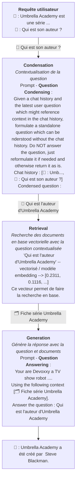

Nous allons maintenant voir comment configurer ces différentes maillons de la chaine.
Tock vous permet de personnaliser les prompts et définir les modèles utilisés.

## Configuration

Dans le menu de gauche au niveau **Gen AI** > **RAG Settings** (Retrieving augmented Generation) vous allez pouvoir 
choisir les modèles d'IA générative pris en charge par Tock et de configurer un ensemble de critères spécifiques à chaque fournisseur d'IA.
Cette fonctionnalité permettra à TOCK de générer une réponse à une requête de l'utilisateur, sur la base d'un ensemble de documents intégrés dans une base de données vectorielle.

> Pour accéder à cette page il faut bénéficier du rôle **_botUser_**, role que vous avez en étant admin.

### Condensation

Il s'agit du modèle utilise pour contextualiser la question de l'utilisateur avec l'historique de la conversation.

Écran d'exemple d'une configuration ollama avec le modèle `qwen2.5:3b`, pull depuis la machine gpu.
Vous pouvez très bien utiliser un autre modèle.

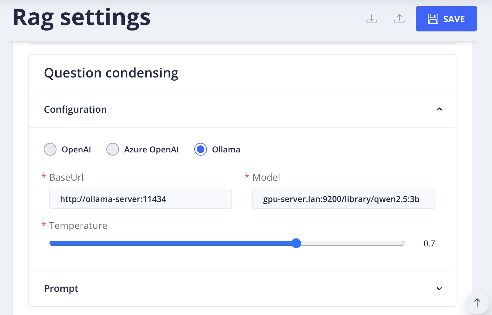

**Un provider IA :** (LLM Engine)

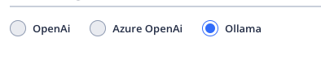

- Cette section permet de paramétrer les options liées au modèle IA qui génère la réponse à l’utilisateur.
- Voir la [liste des fournisseurs d'IA](providers/gen-ai-provider-llm-and-embedding.md)

**Température :**

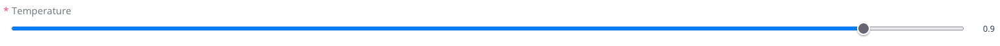

- On peut définir une température située entre 0 et 1.
- Celle-ci permet de déterminer le niveau de créativité du Bot dans la réponse apportée à une requête qui lui est envoyée.

### Génération

Il s'agit du LLM utilisé pour génération la réponse finale avec les éléments de la base documentaire.

Écran d'exemple d'une configuration ollama avec le modèle `qwen2.5:3b`, pull depuis la machine gpu.
Vous pouvez très bien utiliser un autre modèle.

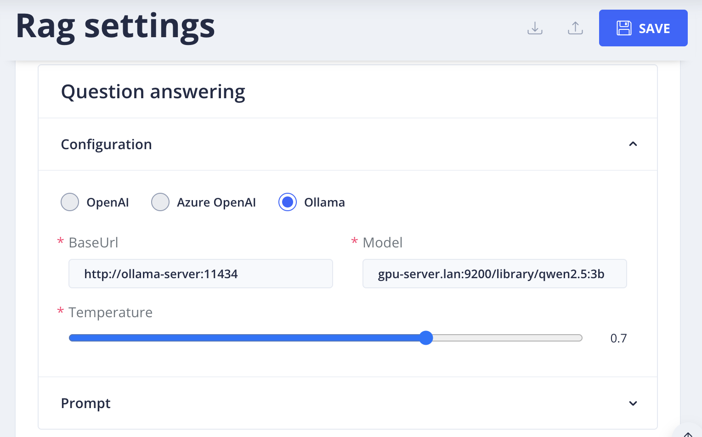

*Voir section précédent pour les explications concernant la température et le fournisseur IA.*

**Prompt :**

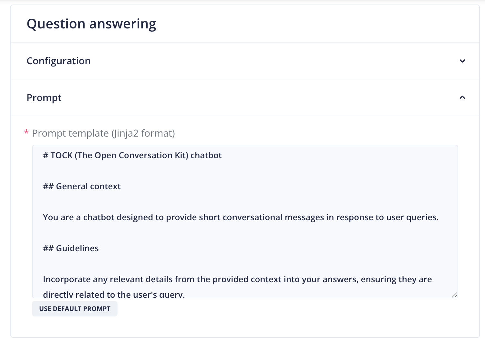

- Le prompt est le script qui détermine la personnalité du Bot, le contexte dans lequel il doit répondre, la façon dont il doit s’adresser à l’utilisateur, les recommandations ou instructions de réponses, les styles et formats de réponses.

Nous personnaliserons le prompt dans une prochaine étape 😉.

### Modèle de vectorisation - Embedding

Ce modèle est utilisé pour générer des vecteurs représentant sémantiquement le sens des la question utilisateur il doit 
être le même que celui utilisé pendant la phase d'ingestion.

Nous vous conseillons de suivre la configuration Ollama.

#### Configurer Ollama pour Emdedding

  
Voir la configuration Ollama

Pour connecter Ollama à Tock studio sur la partie embedding, il vous faut renseigner l’accès à Ollama via cette url d’accès (**BaseUrl**) : http://ollama-server:11434.
Pour le modèle (**Model**), là c’est à vous de renseigner le nom du modèle que vous utilisez dans ce CodeLab
(ici nous avons **nomic-embed-text**).

⚠️ Si Ollama est lancé en local depuis votre ordinateur vous devez changer la valeur de base url de défaut par "http://host.docker.internal:11434"

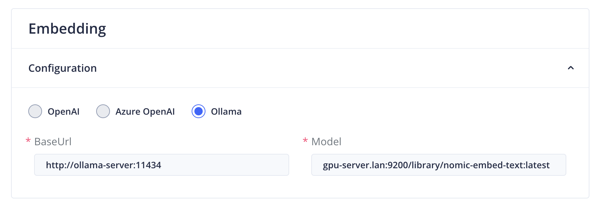

Pour le reste de configuration, nous vous invitons à aller directement au chapitre [Configuration final et activation](#configuration-final-et-activation)

#### Configurer OpenAi pour Emdedding

  
Voir la configuration OpenAi

Si vous souhaitez utiliser openAI, vous devez vous inscrire sur la plateforme [OpenAI](https://platform.openai.com/docs/introduction)
pour obtenir une clé d'API. Une fois cela fait rendez-vous à cette page [https://platform.openai.com/api-keys](https://platform.openai.com/api-keys)
pour générer votre clé d'API.

Dès que vous avez votre clé d'API, vous pouvez la renseigner dans le champ **API Key** et choisir le model
(**Model name**) actuellement disponible : **text-embedding-ada-002**.
Par exemple vous pourriez avoir ce genre de rendu.

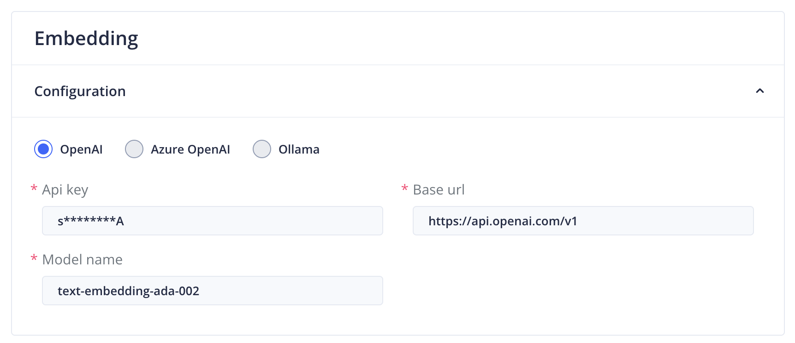

Pour le reste de configuration, nous vous invitons à aller directement au chapitre [Configuration final et activation](#configuration-final-et-activation)

#### Configurer AzureOpenAI pour Emdedding

  
Voir la configuration AzureOpenAI

Si vous souhaitez utiliser Azure OpenAI, vous devez vous inscrire sur la plateforme
[Azure OpenAI](https://azure.microsoft.com/fr-fr/products/ai-services/openai-service) et d'avoir un compte professionnel  
afin d'avoir une clé d'API.
Une fois cela fait, vous pouvez renseigner votre clé d'API dans le champ **API Key** et choisir le model (**Model name**)
que vous souhaitez utiliser.

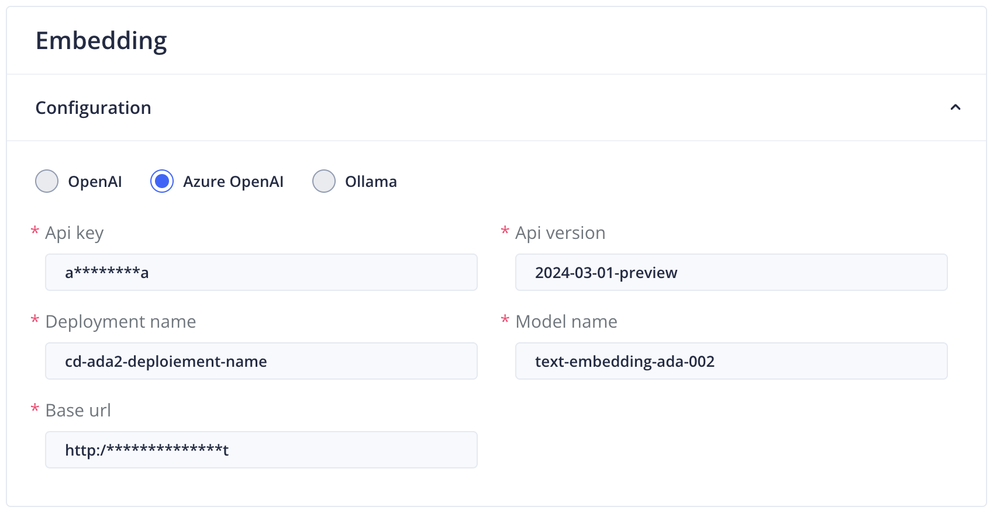

Pour le reste de configuration, nous vous invitons à aller directement au chapitre [Configuration final et activation](#configuration-final-et-activation)

### Autres exemples de configurations LLM (condensation / generation)

Si vous ne souhaitez pas utiliser Ollama comme LLM de condensation et / ou génération.
Voici des exemples avec OpenAI et Azure OpenAI.

### Configurer OpenAi pour LLM Engine

  
Voir la configuration OpenAi

Si vous souhaitez utiliser openAI, vous devez vous inscrire sur la plateforme [OpenAI](https://platform.openai.com/docs/introduction)
pour obtenir une clé d'API. Une fois cela fait rendez-vous à cette page [https://platform.openai.com/api-keys](https://platform.openai.com/api-keys) pour générer votre clé d'API.

Dès que vous avez votre clé d'API, vous pouvez la renseigner dans le champ **API Key** et choisir le model (**Model name**) que vous souhaitez utiliser.
Par exemple vous pourriez avoir ce genre de rendu.

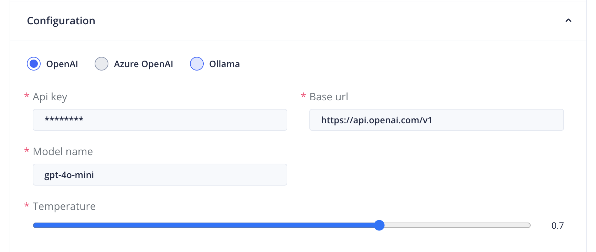

### Configurer AzureOpenAI pour LLM Engine

  
Voir la configuration AzureOpenAI

Si vous souhaitez utiliser Azure OpenAI, vous devez vous inscrire sur la plateforme
[Azure OpenAI](https://azure.microsoft.com/fr-fr/products/ai-services/openai-service) et d'avoir un compte professionnel  
afin d'avoir une clé d'API.
Une fois cela fait, vous pouvez renseigner votre clé d'API dans le champ **API Key** et choisir le model (**Model name**)
que vous souhaitez utiliser.

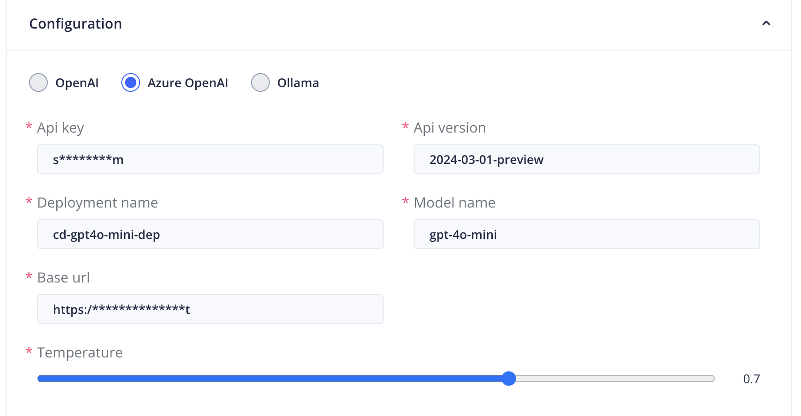

### Configuration final et activation
Cette partie s’attarde sur les intitulés **Indexing session** et **Conversation flow**.

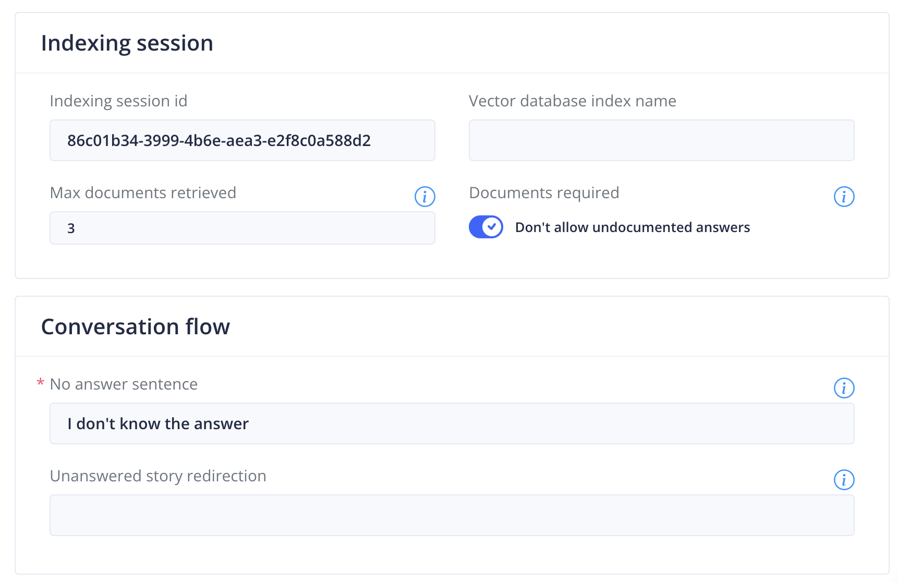

> **Note importante :** 
>
> Il faut que l’ingestion de données et cette configuration finale utilise le même LLM

En [Étape 4](step_4.md), vous avez réalisé une ingestion de données, via un programme en python.
Normalement, si l’ingestion a été correctement réalisé le programme a terminé avec un succès qui affiche des Id, comme dans l’exemple suivant :

  
 🙋‍♂️Je suis sur l'instance partagé je n'ai pas mon ID de session d'indexation

 Vous trouverez l'ID de sessions d'ingestion dans le [Indiana Jones Tock Studio Accounts - Lab Server - Devoxx2025 - Google Sheet](https://docs.google.com/spreadsheets/d/1oNl4oBIJ0TEyhGZRk19Jzi8NHMLcialaBVY95lk-jq4/edit?usp=sharing).

Dans ce résultat, vous avez une variable nommée **Index session ID** qui fournit un identifiant unique.
Copier cet identifiant pour le coller dans le champ **Indexing session id**.
Vous pouvez également choisir le nombre max de documents retourné par la recherche en base documentaire et utilisés pour
générer la réponse, limiter ce nombre est intéressant pour réduire la consommation de token.

Enfin l'option "Don't allow undocumented answers" si elle est activée empêche la génération de réponse si aucun document n'est trouvé,
certains utilisateurs préfère avoir quand même une réponse par exemple le LLM qui demande à préciser la question ... dans ce cas il vaut mieux le désactiver.

Dans l’intitulé **Conversation flow** et dans le champ **No answer sentence**, vous devez spécifier une phrase lorsque l’IA n’est pas capable de répondre.
Par la même occasion, vous pouvez aussi rediriger vers une story spécifique dans le champ **Unanswered story redirection**

Avant de sauvegarder tout ça penser à activer le Rag et les données de debug, ça nous aidera par la suite en haut de la page :
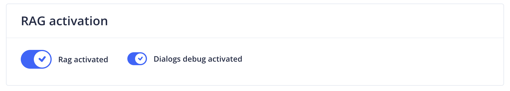

Par exemple si on met à jour les différents éléments et que vous sauvegardez en cliquant en haut sur le bouton bleu 
**SAVE**, vous devriez voir apparaitre une bannière verte signifiant que tout est correcte.

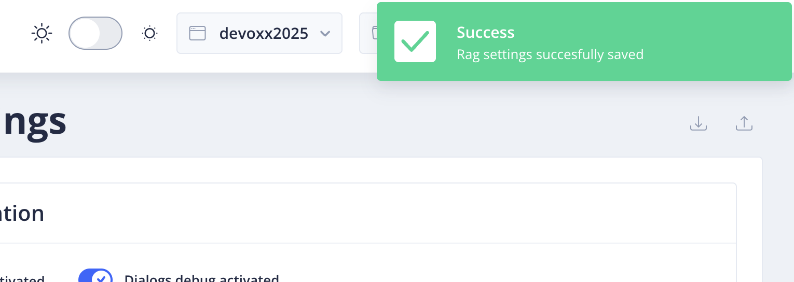

> Il est possible de sauvegarder les paramètre sans activer le RAG dans ce cas aucun check n'est fait.
> Sinon un appel d'embedding et au divers LLM et base vectorielle est fait.

## Interroger le bot

Maintenant vous pouvez discuter avec le bot et lui poser des questions.

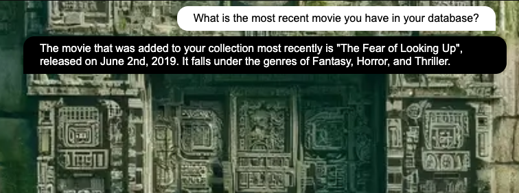

## Étape suivante

- [Étape 6](step_6.md)
