#  Observabilité

[](https://www.youtube.com/watch?v=zc6Q_TNd5pA)

> "Follow the lines that only the gods can read that lead to Orellana's cradle.", Indiana Jones and the Kingdom of the Crystal Skull, Steven Spielberg, 2008
 
<br/>
<u>Objectifs:</u>

- Découvrir langfuse, création d'un compte, projet et clé d'API
- Configurer langfuse dans Tock

## Sommaire

- [ Gen AI - Observability Settings](#gen-ai---observability-settings)
    - [Accéder à Langfuse](#accéder-à-langfuse)
    - [Créer une nouvelle organisation](#créer-une-nouvelle-organisation)
    - [Créer un nouveau projet](#créer-un-nouveau-projet)
    - [Récupérer les clés d'API](#récupérer-les-clés-dapi)


- [Langfuse et Tock Studio](#langfuse-et-tock-studio)
    - [Connecter Tock Studio à Langfuse](#connecter-tock-studio-à-langfuse)
    - [Interroger le bot](#interroger-le-bot)
    - [générer des phrases d'entraînement](#générer-des-phrases-dentraînement)
    - [Voir les traces dans Langfuse](#voir-les-traces-dans-langfuse)


# Gen AI - Observability Settings

- L'observabilité des modèles de langage (LLM Observability) aide à surveiller, d'analyser et de comprendre le comportement des modèles de langage à grande échelle.
- Cela inclut la collecte de données sur leurs performances, la détection d'anomalies et la compréhension des erreurs qu'ils peuvent produire.
- L'objectif est de garantir que ces modèles fonctionnent de manière fiable, transparente, en fournissant des informations qui permettent d'améliorer leur performance et de corriger les problèmes potentiels.

## Docker, lancer le service langfuse

<details>
  <summary>Docker marche pas chez moi je suis sur tock.lan</summary>
  
  Vous pouvez utiliser le langfuse mutualisé sur [http://tock.lan:3000](http://tock.lan:3000).
</details>

Dans le fichier `docker/docker-compose.yml` décommenter la block `langfuse-server:` et relancer un :
```bash
cd docker
source .env
docker compose -p devoxx_tock up -d
```

Vous devriez avoir ce résultat :

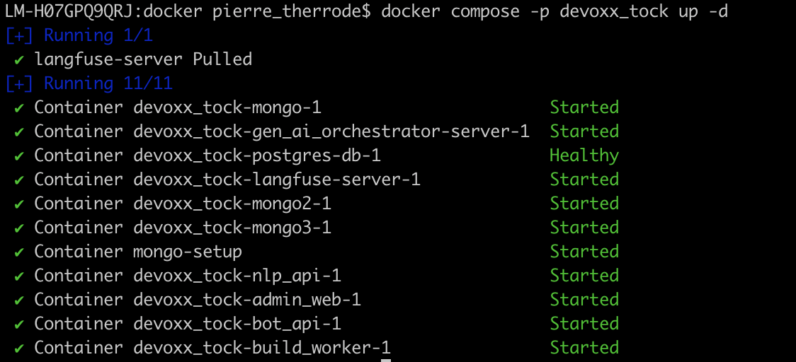


## Accéder à Langfuse
Pour accéder à la plateforme Langfuse, rendez à l'adresse suivante http://localhost:3000/ ou sur http://tock.lan:3000 (si vous êtes sur l'instance mutualisée).

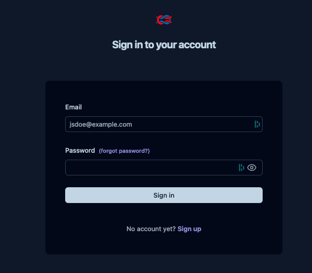

Là vous allez devoir créer un accés, en cliquant sur le bouton **Sign Up** vous allez être redirigé vers la page de création de compte.

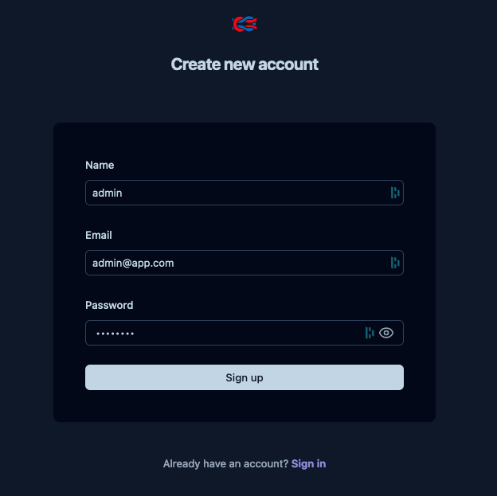

<details>
  <summary>J'utilise le langfuse mutualisé sur tock.lan</summary>
  
  Veuillez suivre les consignes suivantes :
  * Créer un compte avec le même identifiant que sur le Tock Studio (tock.lan)
  * Créer une organisation avec pour nom d'organisation le nom de votre namespace sur Tock Studio
</details>

Dans notre cas, nous allons utiliser le login **admin**, l'email **admin@app.com** et le mot de passe **password** (ces éléments sont donnés à titre d'exemple, vous pouvez utiliser les vôtres).
Une fois que vous avez rempli les champs, cliquez sur le bouton **Sign Up**.

## Créer une nouvelle organisation

Une fois que vous avez créé votre compte, vous allez être redirigé vers la page principale de l’espace admin qui ressemble à celle-ci.

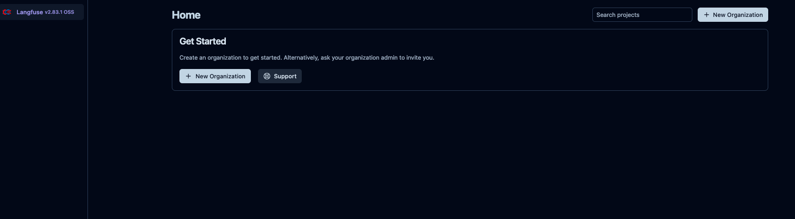

Là vous allez cliquer sur **New Organization**, et lui donner un nom. Dans notre cas, se sera **codelab-tock-2025** (ou votre nom de namespace si vous êtes sur l'instance mutualisée), puis de cliquer sur **Create**.

Vous devriez voir votre nouvelle organisation apparaitre dans la liste des organisations, comme ci-dessous.

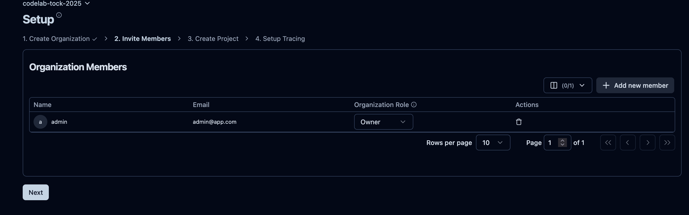

Ensuite vous allez cliquer sur le bouton **Next**.

## Créer un nouveau projet
Là vous allez définir le nom de votre nouveau projet. Dans notre cas, se sera **codelab-tock-project**, puis de cliquer sur **Create**.
Vous devriez voir une nouvelle page apparaitre avec les informations de votre projet.

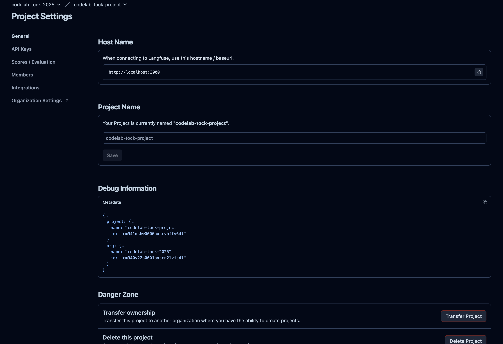

## Récupérer les clés d'API
Sur la page de votre projet, cliquer sur l’onglet API Keys, pour être rediriger sur la page qui centralise toutes les 
clés d’api de votre projet. La liste étant vide, il faut cliquer sur le bouton **+ Create new API keys**.

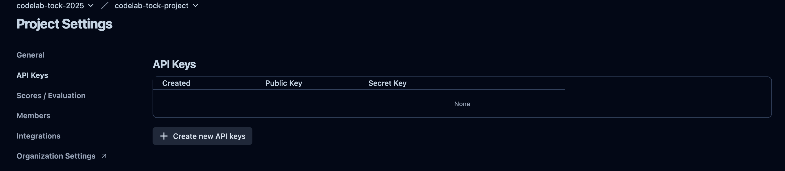

Dès lors, vous allez voir apparaitre une pop-up qui contient les listes d’API-key, comme dans l’exemple suivant :

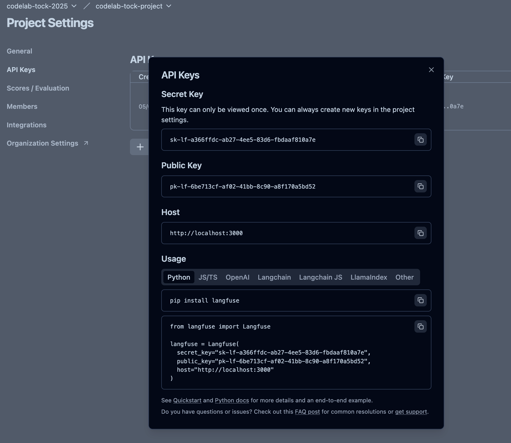

>Ne fermez pas cette pop-up car vous allez en avoir besoin pour connecter Tock à Langfuse !


## Langfuse et Tock Studio

Dans cette partie, nous allons voir comment connecter Tock Studio à Langfuse pour observer les performances du modèle.

### Interlude réseau

Avant de configurer Langfuse dans Tock Studio il est important de comprendre que langfuse va être consommé / accéder
de 2 manières différentes :
 * par l'orchestrateur Gen AI, composant docker-compose `gen_ai_orchestrator-server` qui exécute la chaine RAG :
   * ceci à lieu à l'intérieur du réseau docker on pourra doc l'appeler via http://langfuse-server:3000 car il est
adressé par ce nom au sein du réseau docker. On appellera cet accès l'**URL privée de langfuse**.
   * si vous utilisez l'instance partagée de Tock Studio, au sein de cette instance tourne la même stack docker
   la configuration est donc identique.
 * par vous en tant qu'utilisateur, depuis l'extérieur du réseau docker via http://localhost:3000 ou s'il s'agit du
langfuse partagé via http://tock.lan:3000. On appellera cet accès l'**URL publique de langfuse**.

Ce type de configuration est courrant si vous effectuée un déploiement kube de Tock via
[tock-helm-chart](https://github.com/theopenconversationkit/tock-helm-chart) vous aurez aussi cette typologie
des trace qui remontent internes au cluster et un backoffice accédé par l'extérieur.

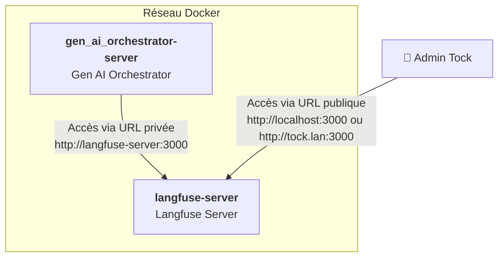

### Connecter Tock Studio à Langfuse

Dans Tock Studio, allez dans le menu de gauche dans **Gen AI** > **Observability settings** pour arriver sur cette page


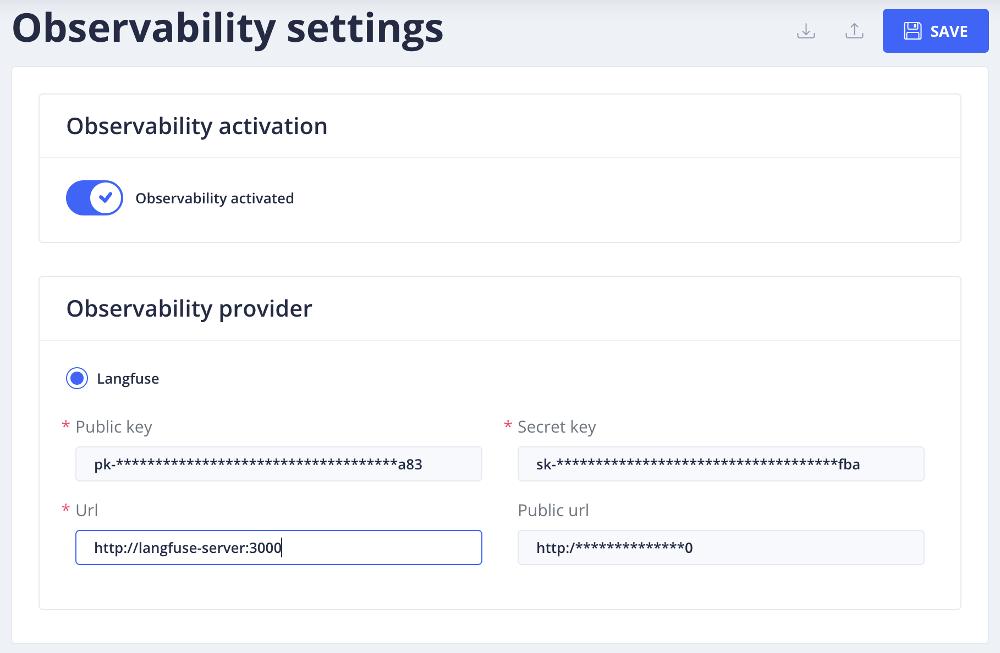

Indiquez donc les valeurs suivantes pour les urls :
* Public Key : celle générée dans langfuse
* Secret Key : celle générée dans langfuse
* Url : il s'agit de l'url privée `http://langfuse-server:3000`
* Url Public : `http://localhost:3000` OU si vous êtes sur l'instance partagée `http://tock.lan:3000`.

⚠️ N'oubliez pas d'activer l'option **Observability activation** après avoir rempli les champs et sauvegarder les paramètres.


### Interroger le bot
Pour tester la connexion entre Tock et Langfuse, vous allez interroger le bot avec une phrase d’exemple.
Dans le menu de gauche, allez dans **Bot** > **Test Bot** pour arriver sur cette page.

```bash
What is the Umbrella Academy ?
```

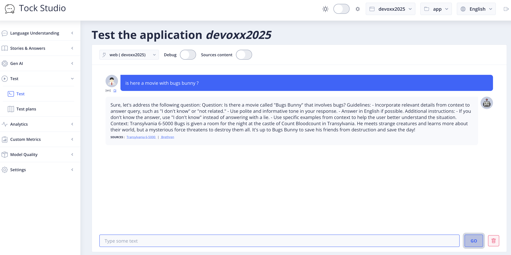

## Retrouver les traces depuis la vue Analytics > Dialogs

Chaque échange avec les bot est historisé et accesible depuis la vue Analytics > Dialogs.

Vous y retrouvez notamment un lien vers la trace langfuse associée à chaque message RAG généré :
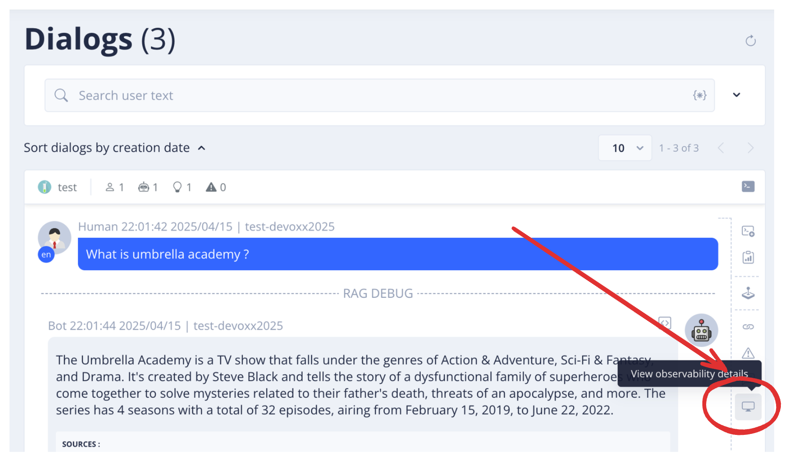

## Depuis le dashboard langfuse

Maintenant, allez sur tableau de bord de Langfuse (http://localhost:3000/) pour voir les traces.

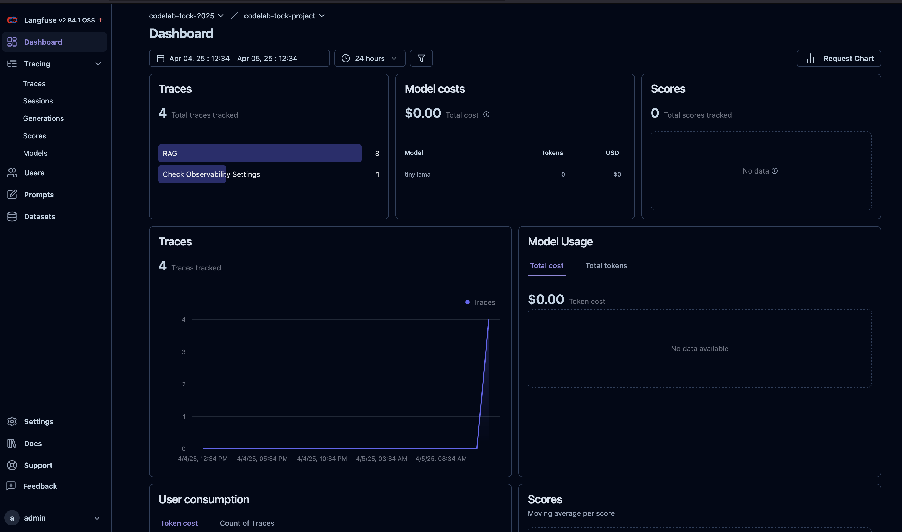

Dans le menu de gauche, allez dans **Tracing** > **Traces** pour arriver sur ce tableau.

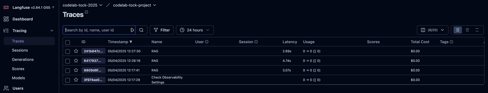

Là, vous allez choisir l’élément dont le nom contient **Sentence Generation**, cliquer sur l’**ID**de ce même élément 
et vous pourrez voir les détails de la génération de phrases ou de mots de cette action.

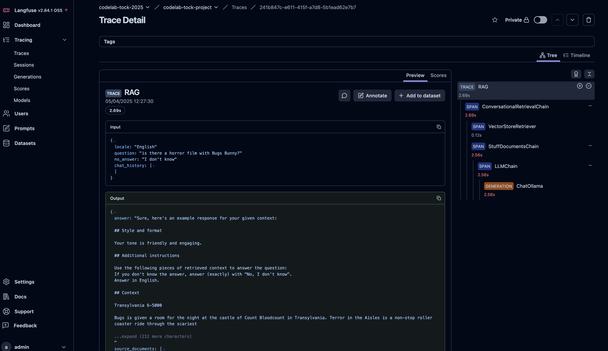

> **Note :** Les éléments varient en fonction de la demande et du type de LLM qui est utilisé pour produire un résultat demandé

Vous y retrouverez aussi les traces des chaines RAG, ce qui vous permet de voir les documents retrouvés cotés base documentaire, les différents prompts qui s'enchainent (effet mémoire...).


## Étape suivante

- [Étape 9](step_9.md)
