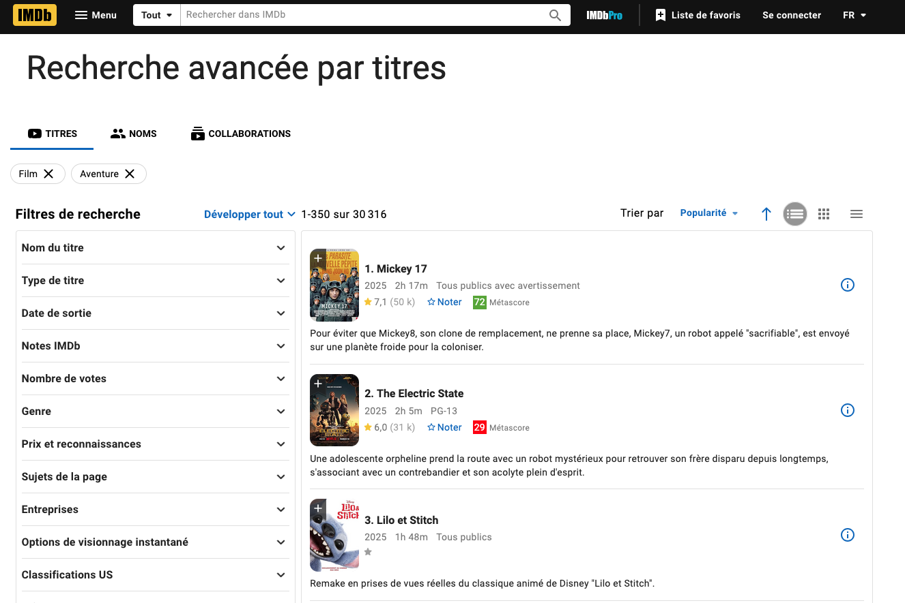
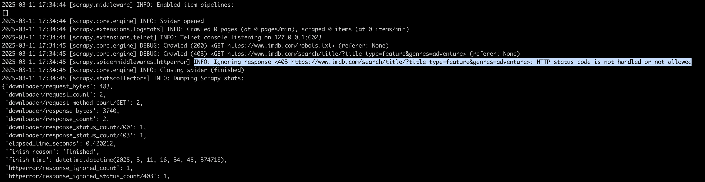
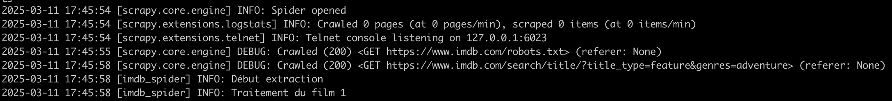
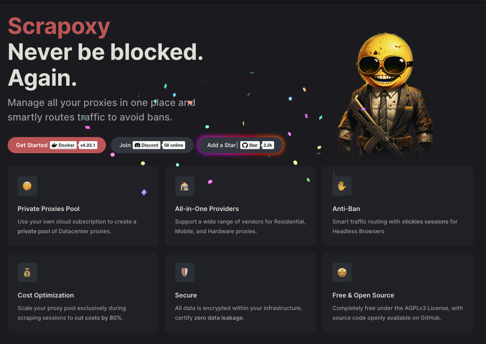

#  Scrapping de données et RAG

[](https://www.youtube.com/watch?v=tI6HUqCDKvw)

> "Get Back", Indiana Jones and the Dial of Destiny, Steven Spielberg, 2023


<br/>
<u>Objectifs:</u>

- Découvrir le scraping de données
- Installer et jouer avec le Framework Scrapy
- Débloquer les 1er protections anti-bot
- Extraire des données d'un site web au format CSV
- Allez plus loin avec le système de proxy


# Sommaire
- [Qu'est-ce que le scraping ?](#quest-ce-que-le-scraping)
  - [Fonctionnement du web scraping](#fonctionnement-du-web-scraping)
  

- [Installer Python](##installer-python)
  - [Créer un environnement virtuel](#créer-un-environnement-virtuel)
  - [Installer Scrapy](#installer-scrapy)
  - [Créer un nouveau projet Scrapy](#créer-un-nouveau-projet-scrapy)
  - [Créer un nouveau Spider](#créer-un-nouveau-spider)


- [Commençons à scraper](#commençons-à-scraper)
  - [Extraire les informations souhaitées](#extraire-les-informations-souhaitées)
  - [Contourner les 1er protections anti-bot](#contourner-les-1er-protections-anti-bot)
  - [Activer le javascript dans les paages](#activer-le-javascript)
  

- [Contourner les protections anti-bot via des proxys](#contourner-les-protections-anti-bot-via-des-proxys)
  - [Proxy low cost](#proxy-low-cost)
    - [Limites des proxys gratuits](#limites-des-proxys-gratuits)
  - [Proxy plus avancé](#proxy-plus-avancé)
  

- [Ingérer la données scrapé dans le RAG](#ingérer-la-données-scrapé-dans-le-rag)


# Qu'est-ce que le scraping ?
Le scraping, également appelé web scraping, est une technique d'extraction automatique de contenu à partir de sites web. 
Il s'agit d'utiliser des programmes informatique spécifiques pour collecter des données structurées sans dénaturer 
la structure du document.

## Fonctionnement du web scraping

Généralement, le scraping se déroule en plusieurs étapes :
  - Le programme de scraping reçoit une URL d'un site web qu'il doit lire
  - Il extrait le code HTML sous-jacent de la page web 
    - Dans le cas d'un programme avancé, ils peut interprété les éléments JavaScript et CSS
  - Le programme extrait ensuite les données spécifiques recherchées

Les données collectées sont généralement structurées dans une base de données ou un tableur pour être facilement exploitables

Pour la suite de ce codelab, nous allons utiliser le site [IMDb](https://www.imdb.com/) pour extraire des informations 
sur les films d'aventure, à savoir :
  - le titre
  - l'année de sortie
  - la durée
  - le résumé
  - le score
  - le lien vers la page du film



Ces informations seront ensuite ingérées dans le RAG de Tock.

# Installer Python
Avant de commencer, assurez-vous d'avoir Python 3 installé sur votre machine.
Depuis votre terminal, vous pouvez vérifier la version de Python installée en exécutant la commande suivante :

```bash
python3 --version
```
Si vous n'avez pas Python 3 installé, vous pouvez le télécharger depuis le site officiel de Python : [python.org](https://www.python.org/downloads/)

## Créer un environnement virtuel

Depuis le dossier du codelab, créez un environnement virtuel pour le projet et activez-le :

```bash
python3 -m venv path/to/venv
```
puis activez-le :

```bash
source path/to/venv/bin/activate
```


## Installer Scrapy

```bash
pip install Scrapy
```

## Créer un nouveau projet Scrapy

```bash
scrapy startproject imdb_scraper
```
Naviguer vers le dossier du projet :

```bash
cd imdb_scraper
```

## Créer un nouveau Spider

```bash
scrapy genspider imdb_spider imdb.com
```

# Commençons à scraper

À présent le framework scrapy est installé et votre projet crée

## Extraire les informations souhaitées
Ouvrez le fichier `imdb_spider.py` et ajoutez le code suivant pour extraire les informations souhaitées:

```python
import scrapy
import re

class ImdbSpider(scrapy.Spider):
  name = "imdb_spider"
  allowed_domains = ["www.imdb.com"]
  start_urls = [
    'https://www.imdb.com/search/title/?title_type=feature&genres=adventure',
  ]

  def parse(self, response):
    if response.status == 200:
      self.logger.info("Début extraction")
      for film in response.css('.ipc-metadata-list'):
        for i in range(1, 25):
          try:
            self.logger.info(f"Traitement du film {i}")
            item = self.extract_movie_information(film, i)
            if item:
              yield item
          except Exception as e:
            self.logger.error(f"Erreur lors du traitement d'un film : {e}")

    # Pour gérer la pagination
    next_page = response.css('a.next::attr(href)').get()
    if next_page is not None:
      next_page = response.urljoin(next_page)
      yield scrapy.Request(next_page, callback=self.parse)

  def extract_movie_information(self, film, index):
    # Fonction pour extraire toutes les informations d'un film
    try:
      title = self.remove_number_before_dot(self.extract_title(film, index))
      url =  self.extract_url(film, index)
      year = self.extract_year(film, index)
      time = self.extract_duration(film, index)
      resume = self.extract_summary(film, index)
      score = self.extract_score(film, index)

      item = {
        'title': title,
        'year': year,
        'time': time,
        'resume': resume,
        'metascore': score,
        'url': url,
      }
      self.logger.info(f"Film traité : {item}")
      return item
    except Exception as e:
      self.logger.error(f"Erreur lors de l'extraction des informations du film : {e}")
      return None

  def extract_title(self, film, index):
    # Extraction du titre du film
    a_element = film.css(f'li.ipc-metadata-list-summary-item:nth-child({index}) > div:nth-child(1) > div:nth-child(1) > div:nth-child(2) > div:nth-child(1) > div:nth-child(2) > div:nth-child(1) > a:nth-child(1) > h3:nth-child(1)').get()
    selector = scrapy.Selector(text=a_element)
    return selector.xpath('.//text()').get()

  def extract_url(self, film, index):
    # Extraction de l'URL de la page détaillée du film
    a_element = film.css(f'li.ipc-metadata-list-summary-item:nth-child({index}) > div:nth-child(1) > div:nth-child(1) > div:nth-child(2) > div:nth-child(1) > div:nth-child(1) > div:nth-child(1) > a:nth-child(3)').get()
    selector = scrapy.Selector(text=a_element)
    return "https://www.imdb.com" + selector.css('a::attr(href)').get().split('/?')[0]

  def extract_year(self, film, index):
    # Extraction de l'année de sortie du film
    span_text = film.css(f'li.ipc-metadata-list-summary-item:nth-child({index}) > div:nth-child(1) > div:nth-child(1) > div:nth-child(2) > div:nth-child(1) > div:nth-child(2) > div:nth-child(2) > span:nth-child(1)').get()
    selector = scrapy.Selector(text=span_text)
    return selector.xpath('.//text()').get().strip()

  def extract_duration(self, film, index):
    # Extraction de la durée du film
    span_text = film.css(f'li.ipc-metadata-list-summary-item:nth-child({index}) > div:nth-child(1) > div:nth-child(1) > div:nth-child(2) > div:nth-child(1) > div:nth-child(2) > div:nth-child(2) > span:nth-child(2)').get()
    selector = scrapy.Selector(text=span_text)
    return selector.xpath('.//text()').get().strip()

  def extract_summary(self, film, index):
    # Extraction du résumé du film
    div_html = film.css(f'li.ipc-metadata-list-summary-item:nth-child({index}) > div:nth-child(1) > div:nth-child(1) > div:nth-child(2) > div:nth-child(2) > div:nth-child(1) > div:nth-child(1)').get()
    selector = scrapy.Selector(text=div_html)
    return selector.xpath('.//text()').get()

  def extract_score(self, film, index):
    # Extraction du score du film
    span_text = film.css(f'li.ipc-metadata-list-summary-item:nth-child({index}) > div:nth-child(1) > div:nth-child(1) > div:nth-child(2) > div:nth-child(1) > div:nth-child(2) > div:nth-child(2) > span:nth-child(4) > span:nth-child(1)').get()
    selector = scrapy.Selector(text=span_text)
    return selector.xpath('.//text()').get().strip()


  def remove_number_before_dot(self, text):
    # Supprime le numéro de classement (ex: "1. ") au début du titre
    return re.sub(r'^\d+\.\s', '', text)

  def escape_csv_field(self, text):
    # Échapper correctement les champs pour le format CSV
    if text is None:
      return ""
    # Remplacer les guillemets par des doubles guillemets
    text = text.replace('"', '""')
    # Si le texte contient des virgules, des guillemets ou des sauts de ligne, l'entourer de guillemets
    if ',' in text or '"' in text or '\n' in text or '\r' in text:
      text = f'"{text}"'
    return text

```

Configurer le pipeline pour exporter en CSV : Dans le fichier `settings.py`, ajoutez ou modifiez la ligne suivante pour exporter les données en CSV:

```bash
FEED_FORMAT = 'csv'
FEED_URI = 'file:///MODIFIER_CETTE_VALEUR/imdb_films.csv'  # Chemin d'export à modifier
```

Exécutez le Spider : Exécutez le Spider en utilisant la commande suivante:

```bash
scrapy crawl imdb_spider
```
Là vous devriez avoir une erreur de type 403, c'est normal, c'est une protection anti-bot.



## Contourner les 1er protections anti-bot

Une premiére étape de contournement consiste à utiliser un User-Agent de votre requête, tout en rajoutant un timer. Pour cela, ajoutez la ligne suivante dans le fichier `settings.py`:

```bash
USER_AGENT = 'Mozilla/5.0 (Windows NT 10.0; Win64; x64) AppleWebKit/537.36 (KHTML, like Gecko) Chrome/58.0.3029.110 Safari/537.3'
DOWNLOAD_DELAY = 1.5  # Attendre 1,5 seconde entre chaque requête
```

Relancez le Spider : Relancez le Spider en utilisant la commande suivante:

```bash
scrapy crawl imdb_spider
```
Normalement, scrapy vous retourne un code 200 et vous devriez voir les informations extraites dans le fichier CSV.


Toutefois, ces informations ne sont pas complètes, car il faut cliquer sur le bouton "50 en plus" pour charger plus de 
films. Bouton qui est en fait un bouton javascript, et donc il faut utiliser un autre moyen pour le cliquer.

## Activer le javascript
Pour activer le javascript dans les pages, il faut utiliser un middleware. Pour cela, installez le package `scrapy-selenium`:

```bash
pip install scrapy-selenium
```
Créez le fichier `imdb_spider_selenium.py` et ajoutez le code suivant pour extraire les informations souhaitées:

```python
import scrapy
import re
import time
from selenium import webdriver
from selenium.webdriver.common.by import By
from selenium.webdriver.support.ui import WebDriverWait
from selenium.webdriver.support import expected_conditions as EC
from selenium.common.exceptions import TimeoutException, NoSuchElementException
from scrapy.http import HtmlResponse

class ImdbSpiderSelenium(scrapy.Spider):
  name = "imdb_spider_selenium"
  allowed_domains = ["www.imdb.com"]
  start_urls = [
    'https://www.imdb.com/search/title/?title_type=feature&genres=adventure',
  ]

  def __init__(self, *args, **kwargs):
    super(ImdbSpiderSelenium, self).__init__(*args, **kwargs)
    # Configuration du webdriver
    options = webdriver.ChromeOptions()
    options.add_argument('--headless')
    options.add_argument('--disable-gpu')
    options.add_argument('--no-sandbox')
    options.add_argument('--disable-dev-shm-usage')
    options.add_argument('--window-size=1920,1080')
    options.add_argument('user-agent=Mozilla/5.0 (Windows NT 10.0; Win64; x64) AppleWebKit/537.36 (KHTML, like Gecko) Chrome/90.0.4430.212 Safari/537.36')
    self.driver = webdriver.Chrome(options=options)

  def parse(self, response):
    # Utiliser Selenium pour charger la page
    self.driver.get(response.url)
    self.logger.info(f"Page chargée: {response.url}")

    # Attendre que la page soit complètement chargée
    time.sleep(5)

    # Nombre de fois à cliquer sur "50 en plus"
    click_count = 100

    # XPath exact du bouton fourni par l'utilisateur
    button_xpath = "/html/body/div[2]/main/div[2]/div[3]/section/section/div/section/section/div[2]/div/section/div[2]/div[2]/div[2]/div/span/button"

    for i in range(click_count):
      try:
        # Faire défiler jusqu'en bas de la page pour s'assurer que le bouton est chargé
        self.driver.execute_script("window.scrollTo(0, document.body.scrollHeight);")
        time.sleep(2)

        # Attendre que le bouton soit présent dans le DOM
        WebDriverWait(self.driver, 10).until(
          EC.presence_of_element_located((By.XPATH, button_xpath))
        )

        # Trouver le bouton avec le XPath exact
        load_more_button = self.driver.find_element(By.XPATH, button_xpath)

        # Faire défiler jusqu'au bouton pour s'assurer qu'il est visible
        self.driver.execute_script("arguments[0].scrollIntoView(true);", load_more_button)
        time.sleep(1)

        # Vérifier si le bouton est cliquable
        if load_more_button.is_displayed() and load_more_button.is_enabled():
          # Cliquer sur le bouton
          load_more_button.click()
          self.logger.info(f"Clic #{i+1} sur le bouton '50 en plus'")

          # Attendre le chargement des nouveaux éléments
          time.sleep(5)
        else:
          # Si le bouton n'est pas cliquable, essayer de cliquer via JavaScript
          self.logger.info("Bouton trouvé mais non cliquable, tentative via JavaScript")
          self.driver.execute_script("arguments[0].click();", load_more_button)
          time.sleep(5)

      except Exception as e:
        self.logger.error(f"Erreur lors du clic sur le bouton (tentative {i+1}): {e}")
        # Prendre une capture d'écran pour le débogage
        self.driver.save_screenshot(f'error_click_{i+1}.png')

        # Essayer une approche alternative avec JavaScript
        try:
          self.logger.info("Tentative alternative avec JavaScript")
          clicked = self.driver.execute_script("""
                        var buttons = document.querySelectorAll('button');
                        for (var i = 0; i < buttons.length; i++) {
                            if (buttons[i].textContent.includes('50 en plus')) {
                                buttons[i].click();
                                return true;
                            }
                        }
                        return false;
                    """)
          if clicked:
            self.logger.info("Clic réussi via JavaScript")
            time.sleep(5)
          else:
            self.logger.warning("Bouton '50 en plus' non trouvé via JavaScript")
        except Exception as js_error:
          self.logger.error(f"Erreur lors de la tentative JavaScript: {js_error}")
          break

    # Créer une nouvelle réponse à partir du contenu de la page après les clics
    self.logger.info("Extraction des données de la page mise à jour")
    updated_response = HtmlResponse(
      url=response.url,
      body=self.driver.page_source.encode('utf-8'),
      encoding='utf-8'
    )

    # Extraction des films avec la page mise à jour
    films = updated_response.css('.ipc-metadata-list-summary-item')
    self.logger.info(f"Nombre de films trouvés: {len(films)}")

    for i, film in enumerate(films, 1):
      try:
        self.logger.info(f"Traitement du film {i}")
        item = self.extract_film_info(film)
        if item:
          yield item
      except Exception as e:
        self.logger.error(f"Erreur lors du traitement du film {i}: {e}")

  def extract_film_info(self, film):
    try:
      # Extraction avec des sélecteurs plus robustes
      title = film.css('h3.ipc-title__text::text').get()
      if title:
        title = title.strip()
        # Supprimer les numéros au début (ex: "1. Film Title")
        title = re.sub(r'^\d+\.\s*', '', title)

      url = film.css('a.ipc-title-link-wrapper::attr(href)').get().split('/?')[0]
      if url:
        url = "https://www.imdb.com" + url

      # Extraction des métadonnées
      metadata_items = film.css('.dli-title-metadata-item::text').getall()
      year = metadata_items[0].strip() if len(metadata_items) > 0 else None
      time = metadata_items[1].strip() if len(metadata_items) > 1 else None

      resume = film.css('.ipc-html-content-inner-div::text').get()
      if not resume:
        resume = film.css('.ipc-html-content-inner-div p::text').get()

      score = film.css('.ipc-rating-star--imdb::text').get()
      if score:
        score = score.strip()

      item = {
        'title': title,
        'year': year,
        'time': time,
        'resume': resume,
        'metascore': score,
        'url': url,
      }
      return item
    except Exception as e:
      self.logger.error(f"Erreur lors de l'extraction des informations du film : {e}")
      return None

  def closed(self, reason):
    # Fermer le navigateur à la fin
    self.driver.quit()

```
Avant d'exécuter le spider, prenez le temps de lire le code et de comprendre les différentes étapes. Dés que cela est fait
exécutez le Spider en utilisant la commande suivante :

```bash
scrapy crawl imdb_spider_selenium
```

# Contourner les protections anti-bot via des proxys

⚠️ La suite de l'étape 9 est à titre informatif. Il est important de respecter les lois en vigueur concernant 
le scraping de données.


## Proxy low cost

Une première approche consiste à utiliser des proxys afin de se cacher derrière une adresse IP qui n’est pas la sienne pour ralentir le moment où l’on va être bloqué.

Il est possible d’utiliser des proxys gratuits que l’on peut trouver sur Internet.

Cependant, ces proxys sont souvent lents et peu fiables. Il est aussi possible d'utiliser le logiciel open source proxy Tor pour scraper des sites web.

L’idée derrière cela est de se servir de la multitude de nœuds de sorties qui sont dispatchés à travers le monde, et ainsi avoir plusieurs adresse IP différentes.

Dès lors le fait de changer d’adresse d’IP de façon pseudo dynamique est une technique de type round-robbin.

Cette technique du round-robbin consiste à faire tourner les nœuds de sortie de manière aléatoire pour éviter le blocage.


Le projet suivant est un projet sur github qui permet de faire du round-robbin d’adresse IP via Tor.

```
               Docker Container
               -------------------------------------
               (Optional)           <-> Tor Proxy 1
Client <---->   Privoxy <-> HAproxy <-> Tor Proxy 2
                                    <-> Tor Proxy n
```
source: https://github.com/pi-2r/round-robin-tor-proxy/

⚠️ Attention à ne pas lancer l'image Docker quand vous êtes sur votre réseau d'entreprise.

# Limites des proxys gratuits

L’utilisation de proxys gratuits peut se heurter à plusieurs limites, comme :
- Le fait qu’ils soient vites repérés par les systèmes de protections
- Qu’ils sont parfois lents
- Qu’ils sont peu fiable d’un point de vue disponibilité
- Le fait qu’ils soient sans support client


## Proxy plus avancé

Il est possible d’utiliser des systèmes proxys plus avancés qui permettent d’échapper à certains blocages. 
En guise d’exemple on peut citer le projet open source [Scrapoxy](https://scrapoxy.io/).

[](https://scrapoxy.io/)

## Ingérer la données scrapé dans le RAG
Pour ingérer les données scrapées dans le RAG de Tock, il faut utiliser le fichier CSV généré par le spider et 
l'importer dans la base de données vectorielle de Tock.


## Ressources

| Information                                                    | Lien                                                                                                               |
|----------------------------------------------------------------|--------------------------------------------------------------------------------------------------------------------|
| Warning : Web scraping et RGPD                                 | https://www.plravocats.fr/blog/data-protection-rgpd/warning-web-scraping-et-rgpd                                   |
| Le web scraping est-il illégal ?                               | https://datadome.co/fr/guides-fr/scraping-fr/le-web-scraping-est-il-illegal/                                       |
| Comment pratiquer le scraping de données en toute légalité ?   | https://www.leto.legal/guides/comment-pratiquer-le-scraping-de-donnees-en-toute-legalite                           |
| Web Scraping with Python: Data Extraction from the Modern Web  | https://www.oreilly.com/library/view/web-scraping-with/9781098145347/                                              |
| scrapy                                                         | https://scrapy.org/                                                                                                |
| Le projet Tor                                                  | https://www.torproject.org/fr/                                                                                     |
| Tor (network)                                                  | https://en.wikipedia.org/wiki/Tor_(network)                                                                        |
| Comment mettre en place un proxy TOR ?                         | https://korben.info/installer-proxy-tor.html                                                                       |
| Architecture d’une protection anti-bot (Fabien Vauchelles)     | https://www.youtube.com/watch?v=bW17uUSG5TI                                                                        |
| Scrapoxy: super proxies manager                                | https://scrapoxy.io/                                                                                               |
| Fabien's WebScraping Anti-Ban Workshop                         | https://github.com/scrapoxy/scraping-workshop                                                                      |
| Architecture d’une protection anti-bot (Fabien Vauchelles)     | https://www.youtube.com/watch?v=bW17uUSG5TI                                                                        |


## Étape suivante

- [Étape 10](step_10.md)
