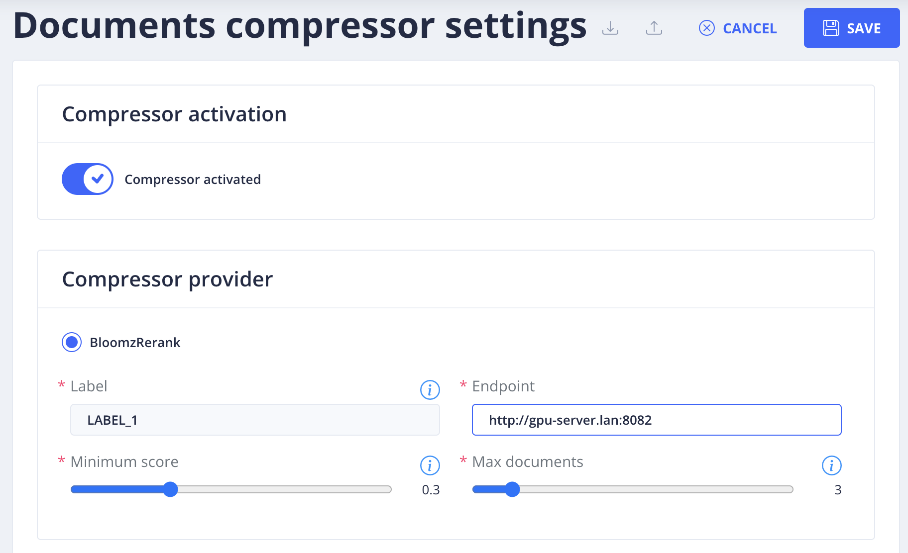
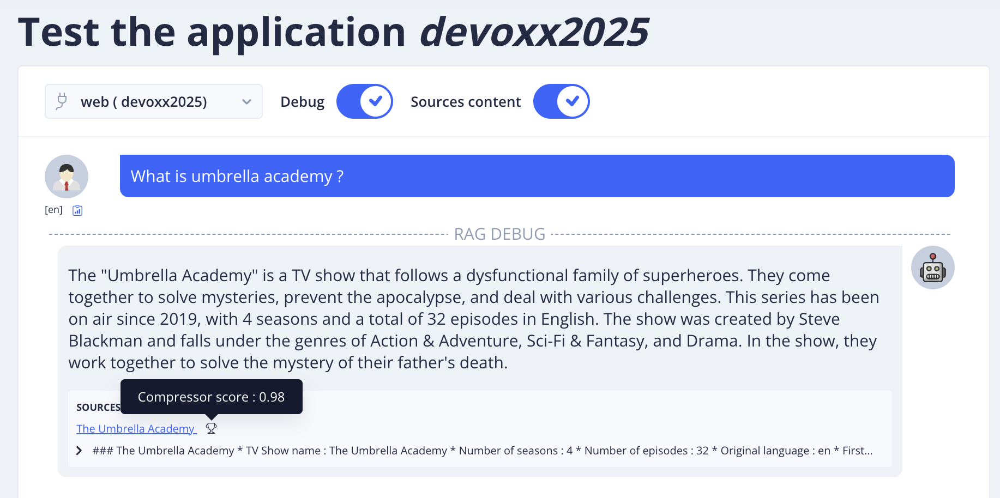

#  Reranking, trouver les bonnes sources

<!-- TODO PIERRE -->

> "MANQUE UNE REF" TODO
 
 
<u>Objectifs:</u>

- Utiliser les sources les plus proches de la requêtes utilisateur
- Filter uniquement les sources pertinentes
- Faire en sorte que le bot réponde en RAG sans source / small talk

## Sommaire

<!-- TOC -->
* [Reranking, trouver les bonnes sources](#reranking-trouver-les-bonnes-sources)
  * [Sommaire](#sommaire)
* [Reranking, mieux choisir les documents](#reranking-mieux-choisir-les-documents)
  * [Pourquoi et ou faire du reranking ?](#pourquoi-et-ou-faire-du-reranking-)
  * [Différentes approches de reranking](#différentes-approches-de-reranking)
  * [Configurer le reranking / Compresseur dans TOCK](#configurer-le-reranking--compresseur-dans-tock)
  * [Tester et ajuster la configuration](#tester-et-ajuster-la-configuration)
<!-- TOC -->

# Reranking, mieux choisir les documents

## Pourquoi et ou faire du reranking ?

Vous avez du remarquer votre bot répond toujours avec le même nombre de sources et on va pas se mentir
elles ne sont pas toujours pertinentes.

En effet la recherche en base vectorielle remonte toujours k plus proche documents, k étant la valeur de 
"Max documents retrieved" de la section "Indexing session" des Rag Settings.

Mais si on pouvait mieux trier ces documents ? les ranger entre eux et même mieux calculer un score stable
de proximité avec la question de l'utilisateur... et bien c'est ce que nous allons faire.

Nous allons ajouter un maillon à la chaine RAG, pour avoir :

```mermaid
flowchart TD
  start["`**Requête utilisateur**
  
  🤖 : Umbrella Academy est une série ...
  👨 : Qui est son auteur ?
  `"]
  condensationStage["`**Condensation**
  *Contextualisation de la question*
  
  Prompt - **Question Condensing** :
  Given a chat history and the latest user question which might reference context in the chat history, formulate a standalone question which can be nderstood without the chat history. Do NOT answer the question, just reformulate it if needed and otherwise return it as is.
  
  Chat history : [🤖 : Umb..., 👨 : Qui est son auteur ?]
  
  Condensed question :
  `"]
  retrievalStage["`**Retrieval**
  *Recherche des documents en base vectorielle avec la question contextualisée*
  
  'Qui est l'auteur d'Umbrella Academy' -- vectorisé / modèle embedding --> [0.2311, 0.1116, ...]
  Ce vecteur permet de faire la recherche en base.
  `"]
  rerankingStage["` **Reranking**
  
  Requête utilisateur : *Qui est l'auteur d'Umbrella Academy*
  Passages d'entrée (k=5) : 
  Umbrella Academy,
  Trollhunters: Tales of Arcadia,
  Bee and PuppyCat,
  Wizards: Tales of Arcadia,
  Chilling Adventures of Sabrina
  
  Après reranking (max doc 3, min: 0.1) :
  (0.97) Umbrella Academy,
  (0.16) Trollhunters: Tales of Arcadia
  
  `"]
  augmentedGeneration["`**Generation**
  *Génère la réponse avec la question et documents*
  
  Prompt - **Question Answering** :
  Your are Devoxxy a TV show robot ....
  Using the following context [🗂️ Fiche série Umbrella Academy, Trollhunters].
  Answer the question : Qui est l'auteur d'Umbrella Academy
  `"]
  final["`🤖 : Umbrella Academy a été créé par  Steve Blackman.
  
  Sources :
  (0.97) Umbrella Academy
  (0.16) Trollhunters: Tales of Arcadia
  `"]
  
  start -- 💬 Qui est son auteur ? --> condensationStage
  condensationStage -- 💬 Qui est l'auteur <br> d'Umbrella Academy --> retrievalStage
  retrievalStage -- 🗂️ Fiche séries (k=5): <br>Umbrella Academy, <br>Trollhunters: Tales of Arcadia, <br>Bee and PuppyCat, <br>Wizards: Tales of Arcadia, <br>Chilling Adventures of Sabrina  --> rerankingStage
  rerankingStage -- 🗂️ Fiche séries : <br>(0.97) Umbrella Academy, <br>(0.16) Trollhunters: Tales of Arcadia --> augmentedGeneration
  augmentedGeneration --> final
```

Dans l'exemple : 
* on a configuré coté Rag Setting 5 document en sortie de la recherche en base documentaire
* prise ces 5 document en entrée de reranker et conservé qu'un max de 3 documents ayant un score au dessus de 0.1
* on a filtré les documents ayant un score inférieur à 0.1 pour n'avoir que Umbrella Academy il serait judicieux d'augmenter le score min.

## Différentes approches de reranking

Il est possible d'opérer cette tâche avec 2 grandes approches :
* utilisé un modèle d'IA Gen spécialisé dans cette tâche en entrée il prend une liste de passages / document et requête utilisateur
en sortie il sort à minima une liste de score.
* demander à un gros LLM (générant du text) de formatter en sortie une liste de score, cette approche est coûteuse et
en général moins performante que les modèles spécialisés.

Dans cet atelier nous allons utiliser le modèle [**cmarkea/bloomz-560m-reranking**](https://huggingface.co/cmarkea/bloomz-560m-reranking)
open source par Crédit Mutuel Arkéa et APIsé au travers du serveur [creditmutuelarkea/llm-inference](https://github.com/creditmutuelarkea/llm-inference).

Ce serveur sera appelé par la chaine RAG de l'orchestrateur Gen AI une fois le compresseur activé. On appel cette étape
la compression dans le vocabulaire langchain.

## Configurer le reranking / Compresseur dans TOCK

Pour simplifier les choses nous avons déjà déployé le serveur llm-inference avec
[**cmarkea/bloomz-560m-reranking**](https://huggingface.co/cmarkea/bloomz-560m-reranking) sur
http://gpu-server.lan:8082.

Il vous suffit d'aller le configurer dans Gen AI > Compressor Settings :

Paramètres :
* Label : Il s'agit du nom de la classe de sortie du modèle indicant le score de proximité
documenté dans la model card sur huggingface également visible dans 
* Endpoint : `http://gpu-server.lan:8082`
* Minimum score : Score min d'acceptation des documents à ajouter a vos besoins. Vous pourrez voir les scores affichés sur les sources.
* Max documents : Nombre max de documenté conservé (ayant les plus hauts score).

## Tester et ajuster la configuration
Dans l'exemple ci-dessous, vous pouvez voir qu'un seul document a été conservé et son score :

Vous pouvez également voir cette étape supplémentaire dans la trace langfuse associée et
ainsi voir les documents en entrée de reranking / compresseurs et ceux conservés en sortie.
